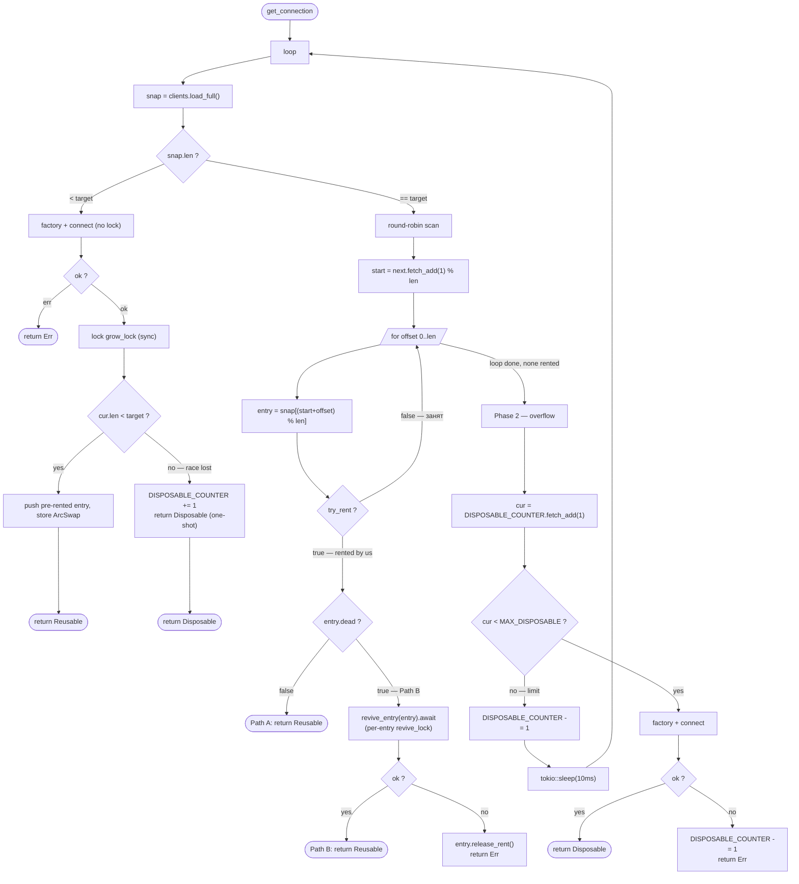
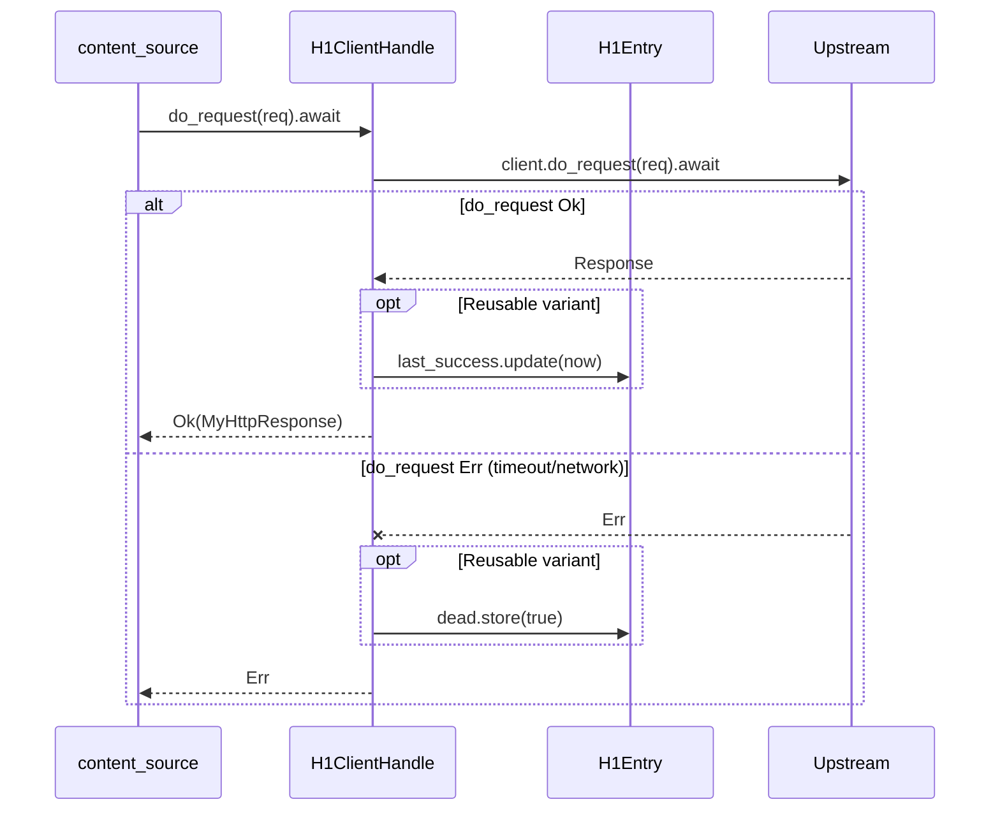
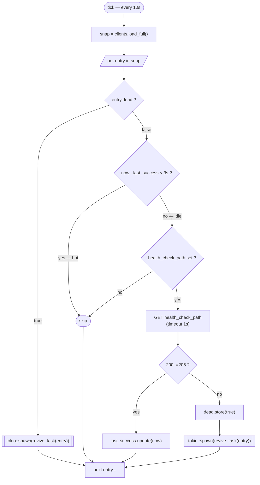
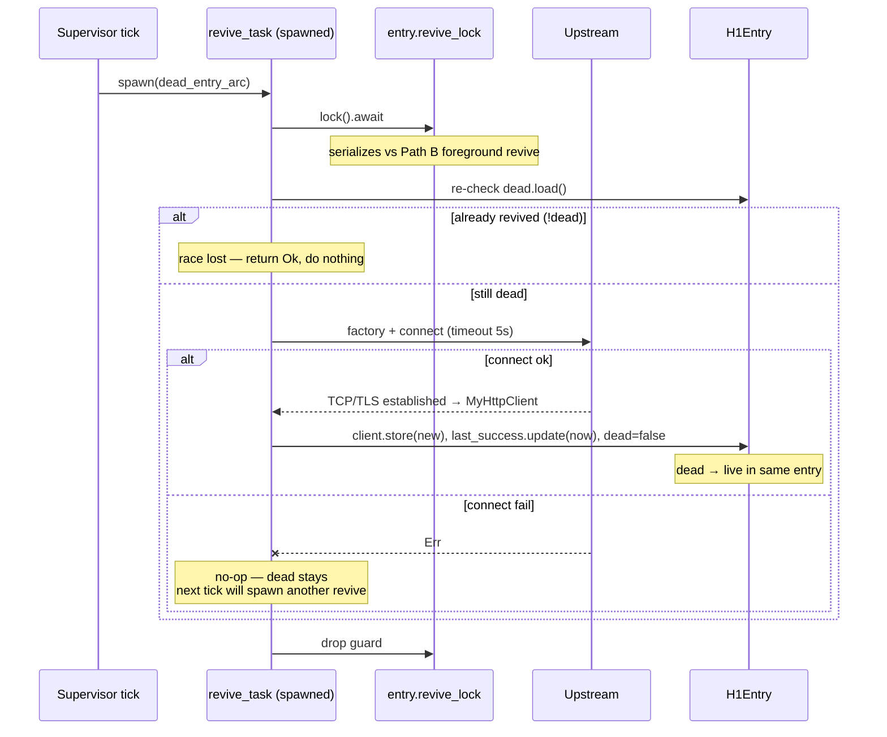
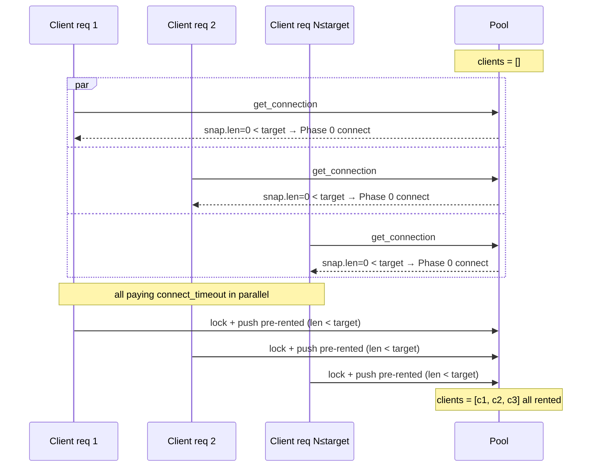
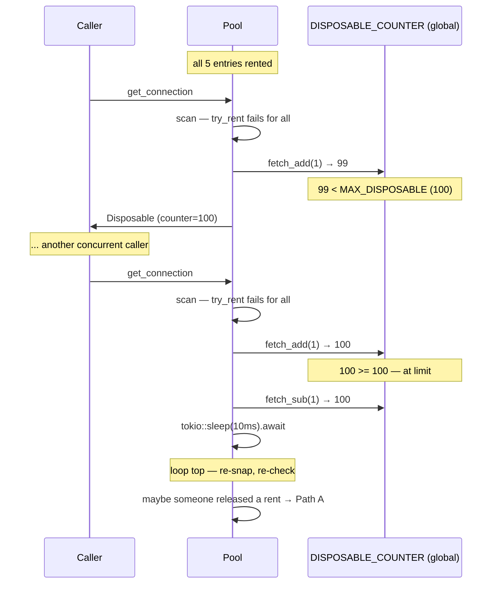
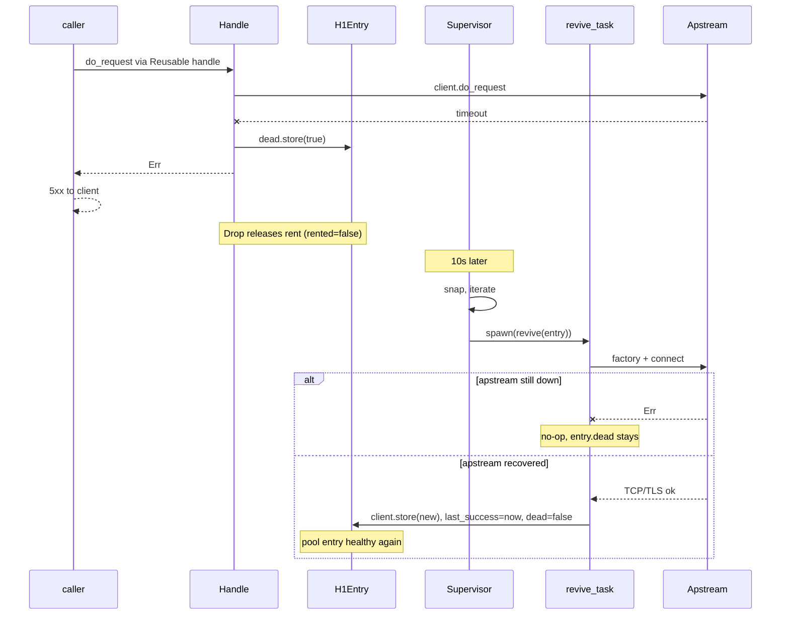
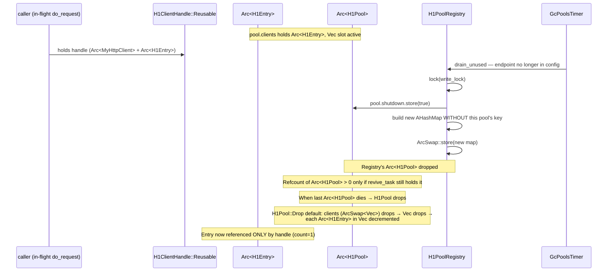
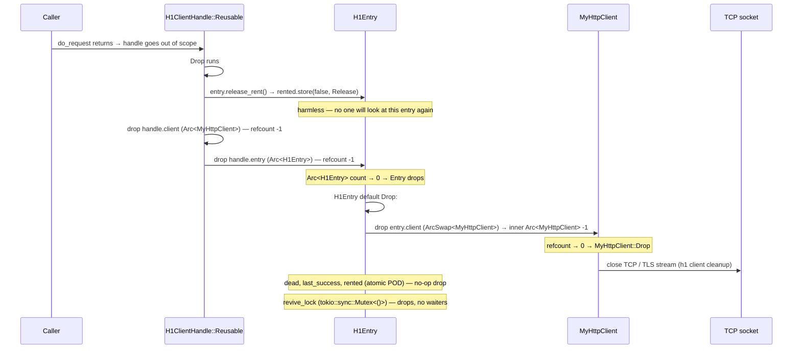

# H1 Upstream Pool — Design

This document describes the design of the per-endpoint HTTP/1.1 upstream connection pool. One pool per `(scheme, host, port)`; `H1PoolRegistry` keeps them by `PoolKey`. Mirrors the [h2 pool](h2-pool.md) design with one h1-specific addition: each entry carries a `rented` flag because h1 is single-stream — only one in-flight request per connection.

## Goals

- Lazy growth: pool starts empty and fills on demand up to `target_size` (5).
- Single-request-per-connection: h1 has no multiplexing; the `rented` flag enforces exclusive use.
- Overflow: when all pool entries are rented, fall back to one-shot disposable connections up to a global cap (`MAX_DISPOSABLE = 100`).
- Self-healing: dead connections detected by passive `do_request` failures or active liveness pings; revival is asynchronous so user requests don't pay the connect latency.
- WebSocket: each WS session opens its own dedicated TCP — independent of the pool, no counter overhead.

## Data structures

```rust
pub struct H1Pool<TStream, TConnector> {
    clients:   ArcSwap<Vec<Arc<H1Entry<TStream, TConnector>>>>,
    grow_lock: parking_lot::Mutex<()>,    // brief, no await — only for Phase 0 push
    target:    u8,                         // 5 (hardcoded today)
    next:      AtomicUsize,                // round-robin scan start
    factory:   ConnectorFactory<TConnector>,
}

pub struct H1Entry<TStream, TConnector> {
    pub client:       ArcSwap<MyHttpClient<TStream, TConnector>>,  // atomic swap on revival
    pub dead:         AtomicBool,
    pub last_success: AtomicDateTimeAsMicroseconds,                // refreshed on every success
    pub rented:       AtomicBool,                                   // h1-specific: 1 in-flight max
    pub revive_lock:  tokio::sync::Mutex<()>,                       // serializes Path B + revive_task
}

pub enum H1ClientHandle<TStream, TConnector> {
    Reusable   { client: Arc<MyHttpClient>, entry: Arc<H1Entry> },
    Disposable { client: Arc<MyHttpClient> },
    Ws         { client: Arc<MyHttpClient> },
}

// Global, all h1 pools share these:
pub const  MAX_DISPOSABLE:     usize       = 100;
pub static DISPOSABLE_COUNTER: AtomicUsize = AtomicUsize::new(0);
```

- `clients` — the pool list. **Lock-free reads** via `ArcSwap::load()`.
- `grow_lock` — only for serializing Phase 0 pushes. Held briefly (no `await`); the connect happens before acquiring it.
- `revive_lock` (per entry) — `tokio::sync::Mutex<()>` held across the connect `await` during revival. Both foreground (Path B) and background (`revive_task`) lock it; re-check of `dead` after acquire prevents duplicate connects.
- `client` (per entry) — `ArcSwap<MyHttpClient>`, atomically replaced on successful revival.
- `dead`, `last_success`, `rented` — per-entry atomics; lock-free, visible to all readers immediately.
- `DISPOSABLE_COUNTER` — global back-pressure for overflow disposables. Inc on creation, dec on Drop.

## get_connection — three phases

`pool.get_connection().await` returns `Result<H1ClientHandle, MyHttpClientError>`. The whole body is wrapped in a `loop` so the overflow back-pressure can re-evaluate.



### Phase summary

| Phase | Trigger | Action | Outcome |
|------|---------|--------|---------|
| **0** | `len < target` | Connect; under `grow_lock` push pre-rented (or hand out as Disposable if race lost). | Lazy growth, no overshoot |
| **1A (Path A)** | `len == target`, scan rented an alive entry | Return Reusable | Hot path |
| **1B (Path B)** | `len == target`, scan rented a dead entry | Revive under `revive_lock`, return Reusable. On revive fail: release rent + Err | Foreground recovery |
| **2 (overflow)** | All entries rented | Up to `MAX_DISPOSABLE` Disposables; over limit → 10ms sleep + retry | Back-pressure |

The "race lost" branches (Phase 0, Phase 2 connect fail) keep the counter consistent: any inc has a matching dec on Drop or undo.

## do_request lifecycle

The handle wraps `MyHttpClient::do_request` and updates entry state:



Notes:
- 4xx/5xx HTTP responses are **not** treated as connection errors — the connection is healthy, the request is bad.
- For Disposable / Ws variants, neither `last_success` nor `dead` is touched.
- Drop releases the rent (Reusable), or decrements the counter (Disposable), or no-op (Ws).

## Supervisor tick

Driven by `MyTimer` (panic-safe). Runs every 10s.



The supervisor never removes anything from the pool itself. Failed revives leave the dead entry in place; the next tick spawns another revive task for it.

### revive_task (tokio::spawn per dead entry)



Concurrency:
- Multiple revive tasks for the same entry are possible (two ticks fired before the first completed). The `revive_lock` + `dead` re-check ensures only one wins; losers drop their fresh client.
- Path B (foreground) and revive_task (background) use the same `revive_lock`, so they don't double-revive.

## create_ws_connection — WebSocket fast path

WS upgrade is detected in content_source via `is_h1_websocket_upgrade(req)`. WS goes through `pool.create_ws_connection().await`, which **bypasses the pool entirely** — it just runs `factory + connect` and returns a fresh `Arc<MyHttpClient>` wrapped in `H1ClientHandle::Ws`.

`create_ws_connection` doesn't touch `clients` and doesn't increment `DISPOSABLE_COUNTER`. The h1 connection lives as long as the WS session, then is dropped. The WS-upgraded TCP stream is extracted into `WebSocketUpgradeStream`; `MyHttpClient::Drop` cleans up when the last Arc dies.

## Concurrency model

| Path | Operation | Synchronization |
|------|-----------|-----------------|
| Hot read (Path A) | Scan + `try_rent` for available entry | `ArcSwap::load()` + `AtomicBool::compare_exchange` — lock-free |
| Round-robin counter | Pick scan start | `AtomicUsize::fetch_add` — lock-free |
| Mark dead | `entry.dead.store(true)` | Atomic — no lock; idempotent |
| Update last_success | `entry.last_success.update(...)` | Atomic — no lock |
| Push (Phase 0) | Append entry under final size check | `grow_lock` (parking_lot) — short critical section, no await |
| Revive (Path B / revive_task) | Replace entry's client under final dead-check | `revive_lock` (tokio::sync::Mutex, per entry) — held across `connect.await` |
| Snapshot for tick | Iterate entries | `ArcSwap::load_full()` — lock-free |
| Disposable counter | Inc/dec | `AtomicUsize::fetch_add/sub` — lock-free |

`grow_lock` is **never held across `await`**. `revive_lock` **is** held across the connect `await` — that's the whole point: it serializes potential duplicate revives.

## Edge cases

### Cold start



The first `target` parallel requests each pay one `connect`. Subsequent gets after caller drops handles will find rented=false on existing entries via Path A.

### Race overshoot prevention

```mermaid
sequenceDiagram
    participant G1 as Get 1
    participant G2 as Get 2
    participant Pool

    Note over Pool: clients = [a, b, c, d] (len=4, target=5)
    G1->>Pool: snap.len < target
    G2->>Pool: snap.len < target
    par
        G1->>G1: factory + connect → x
    and
        G2->>G2: factory + connect → y
    end
    G1->>Pool: lock(grow_lock)
    G1->>Pool: cur.len=4 < 5 → push x (rented=true) → [a,b,c,d,x]
    G1->>Pool: unlock
    G2->>Pool: lock(grow_lock)
    G2->>Pool: cur.len=5 < 5 ? NO → DISPOSABLE_COUNTER += 1
    G2->>Pool: return Disposable y
    G2->>Pool: unlock
    Note over G2: y returned to caller as one-shot;<br/>after caller's Drop: DISPOSABLE_COUNTER -= 1, TCP closes
```

Pool size after both: `[a,b,c,d,x]` — exactly target. `y` served Get 2's request and went away.

### Overflow back-pressure



The retry loop handles transient overload. If the upstream is permanently slow and 100 disposables are stuck, the proxy's `request_timeout` (15s default) bails callers out.

### Upstream went down (single endpoint goes flaky)



In the meantime, foreground gets that round-robin and try_rent past the dead entry hit Path B (also tries to revive — succeeds the moment upstream is back).

### Hot pool — no idle pings

If RPS to an endpoint is high enough that every pool entry sees `last_success` updated within 3s, the supervisor tick **does no pings at all** — every entry is "hot" and skipped. Active probing only kicks in for genuinely idle endpoints, which avoids hammering upstreams that are already known-good.

### WebSocket sessions

WS sessions don't share the pool. Each WS goes through `create_ws_connection` → fresh TCP → returned as `H1ClientHandle::Ws`. The handle's Drop is a no-op; the WS-upgraded TCP stream is extracted into `WebSocketUpgradeStream`. When the WS session closes, the underlying `Arc<MyHttpClient>` drops and TCP closes via `MyHttpClient::Drop`.

WS doesn't count toward `DISPOSABLE_COUNTER` — long-lived WS sessions would otherwise exhaust the back-pressure limit.

## Metrics

Exposed on `/metrics` (Prometheus):

- `h1_pool_size{endpoint="h1://host:port"}` — configured `target` (5).
- `h1_pool_alive{endpoint="..."}` — current `len(clients)` minus `dead` count, set by tick after the pass.

Endpoint label format mirrors the `/configuration` snapshot: `h1://host:port`, `h1s://host:port`, `uds-h1://path`.

`DISPOSABLE_COUNTER` is global; a `h1_disposable_active` gauge is not exposed today (potential add for visibility).

## Hardcoded parameters (today)

- `target_size = 5`
- `MAX_DISPOSABLE = 100` (global, all h1 pools combined)
- `health_check_interval = 10s` (the MyTimer cadence)
- `ping_timeout = 1s`
- `connect_timeout = 5s` (per `PoolParams`, default)
- "Hot threshold" `last_success` window = `3s`
- Overflow retry sleep = `10ms`
- Success status range for ping = `200..=205`

All of these are tracked as tech debt for YAML configuration.

## H1Entry Drop — what happens when its pool is already gone

`H1Entry` doesn't hold a back-reference to `H1Pool`. It has no "find my pool" step in Drop. The default Drop just lets each field clean itself up. So whether the pool still exists or has been drained makes **no difference to H1Entry's own Drop logic** — only to the chain of who decrements which Arc when.

### Setup

Entry is referenced from at most three places:
1. Pool's `clients: ArcSwap<Vec<Arc<H1Entry>>>` — keeps an Arc per slot.
2. Live `H1ClientHandle::Reusable { entry: Arc<H1Entry>, .. }` — one Arc per outstanding rent.
3. Background `revive_task` — captured `Arc<H1Entry>` for the duration of one revival attempt.

`H1Entry` drops when **all three** Arc references are gone.

### Scenario: GcPoolsTimer drains the pool while a request is in-flight

Order of events:



At this point the pool is gone from the registry. The `Arc<H1Pool>` itself may already have dropped (if no revive_task held it), which dropped the pool's `Vec`, which decremented each entry's Arc count by 1.

### Then the request completes



### What does NOT happen

- **No "return to pool" attempt.** `H1ClientHandle::Reusable::drop` does NOT try to look up the pool or re-insert anything. It just calls `entry.release_rent()`, which is one atomic store on a flag inside the entry. There's no `registry.return(...)` call anywhere in the codebase.
- **No `release_rent` failure.** It can't fail — the rent flag is on the entry itself, accessed via the still-alive `Arc<H1Entry>` we hold.
- **No double-close of TCP.** TCP closes exactly once when the last `Arc<MyHttpClient>` dies — which is whenever the last holder (handle, or entry's ArcSwap) drops it.
- **No use-after-free.** Rust's `Arc` guarantees the entry stays alive as long as we hold our reference. Pool dropping its Vec doesn't invalidate our entry; it just decrements the count.

### Edge case: revive_task captured the entry just before drain

Two-step Drop:

1. revive_task's captured `Arc<H1Pool>` ensures the pool is alive while it runs. After drain, the registry no longer has the pool, but revive_task does.
2. revive_task checks `pool.shutdown.load() == true` early and returns. Its captured Arcs (`Arc<H1Pool>`, `Arc<H1Entry>`) drop.
3. Now if no in-flight handle holds the entry either, the entry drops as described above. If a handle still holds it, entry survives until the handle drops.

Same end state, slightly delayed by the time it took the revive_task to notice `shutdown=true`.

### Race with parallel ensure_pool

If, while a request is in-flight on entry from "old" pool, the same endpoint is requested again and a *new* pool is created via `ensure_pool` (because the old pool was drained):

- The new pool has its own fresh `Vec<Arc<H1Entry>>` with brand-new entries.
- The old in-flight request's handle holds the OLD entry, drops it normally, OLD entry's MyHttpClient closes.
- The new pool's entries are independent — they will get connected on their own first `get_connection`.

Two separate "generations" of pool-for-the-same-endpoint can coexist briefly. They don't share state. The OLD generation dies when its last in-flight handle drops; the NEW generation lives on.

## Out of scope

- `http_over_ssh` — still uses the legacy `HttpClientPool` from `src/http_client_pool/`. SSH-tunneled h1 is a different stream type and not migrated.
- See [pool-lifecycle.md](pool-lifecycle.md) for how pools are created on demand and removed by `GcPoolsTimer`.
