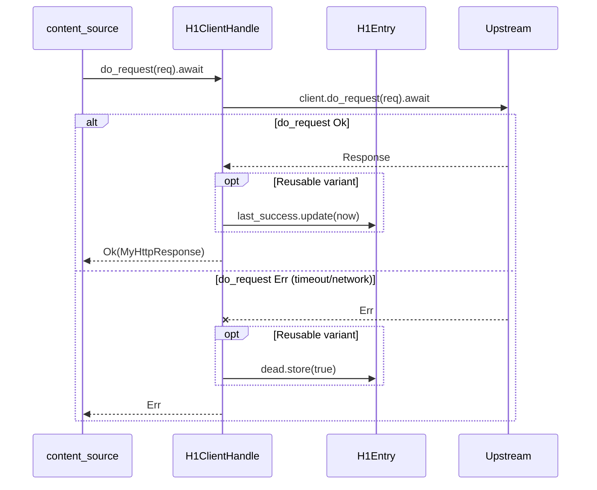
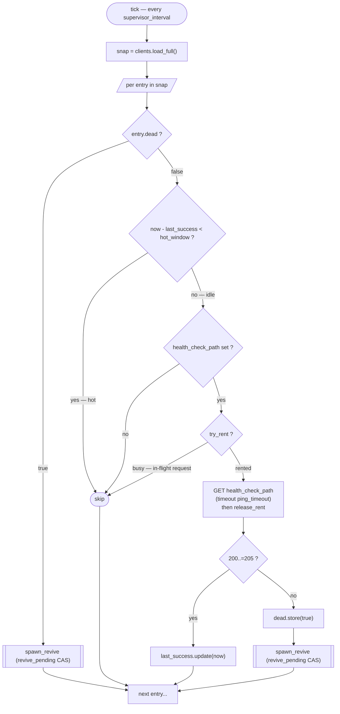
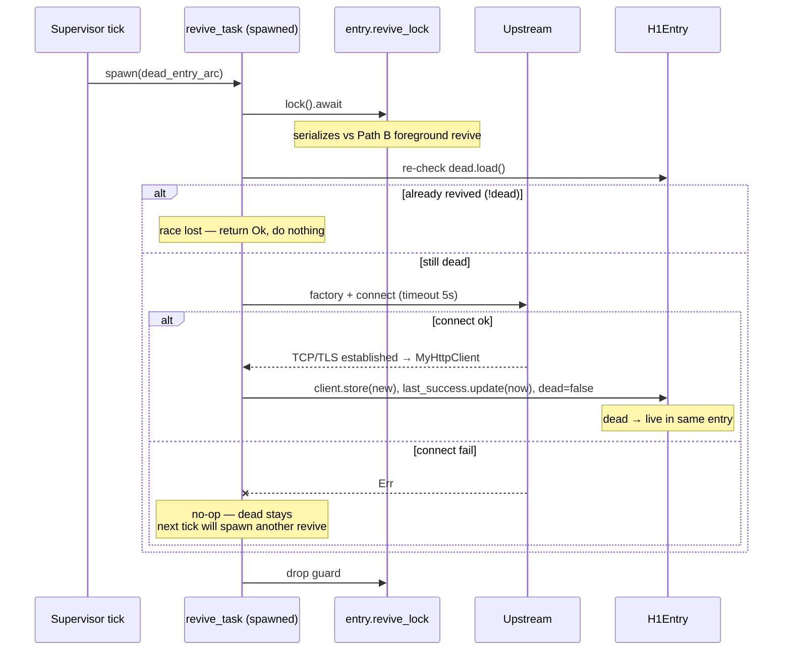
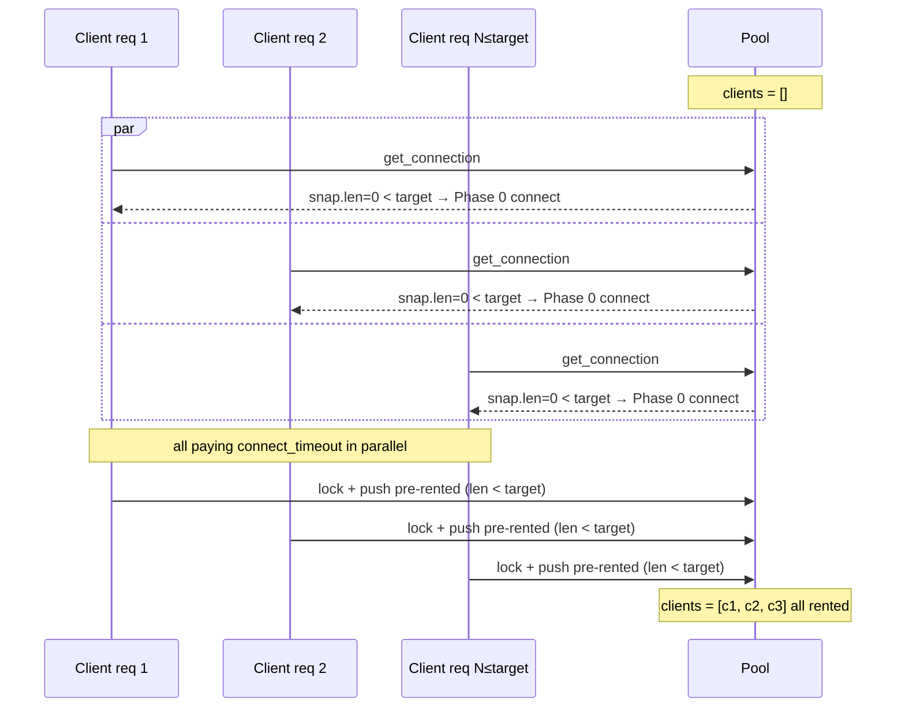
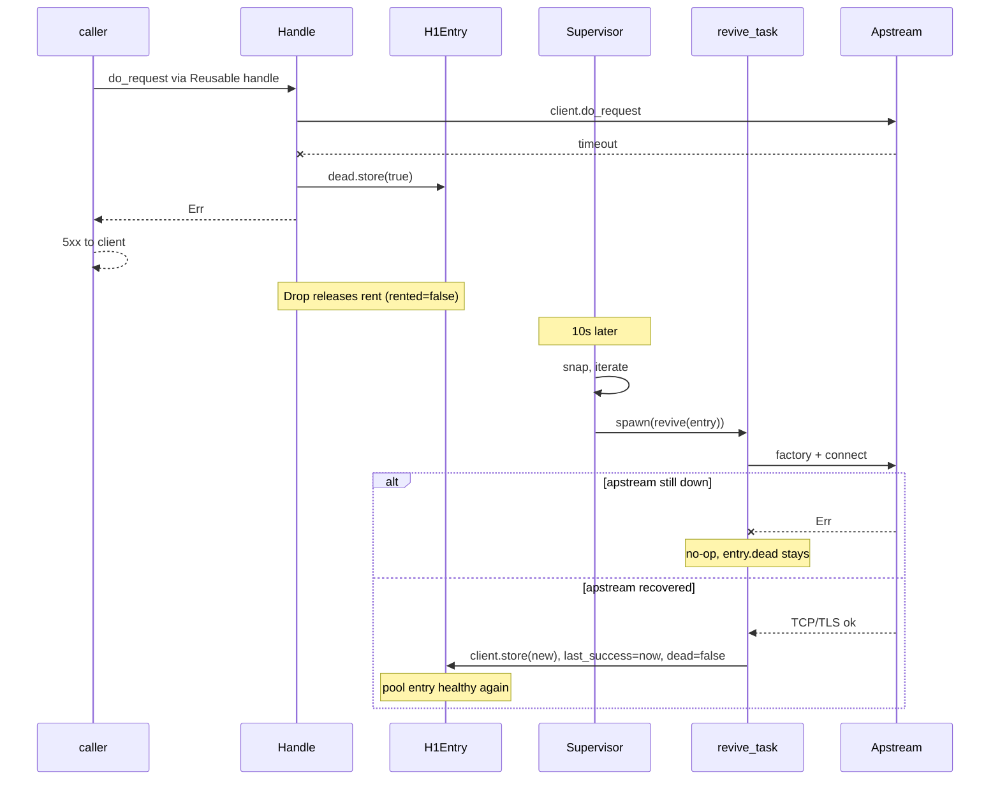
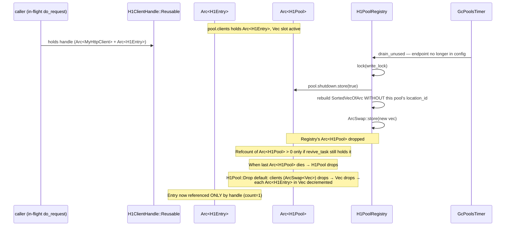
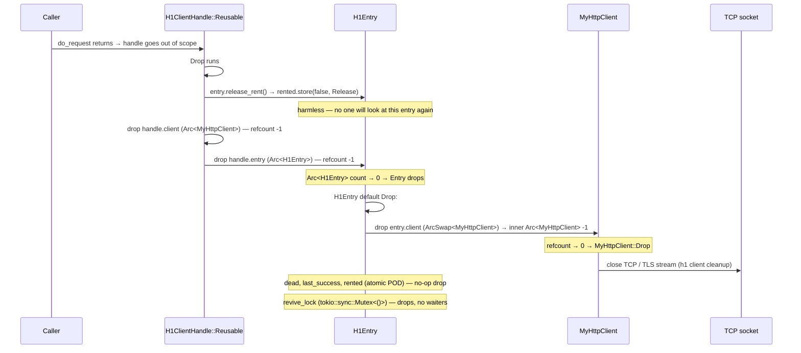

# H1 Upstream Pool — Design

This document describes the design of the per-**location** HTTP/1.1 upstream connection pool. One pool per proxy-pass **location** (`location_id`); `H1PoolRegistry` keeps them in a `SortedVecOfArc<i64, H1Pool>` keyed by `location_id` (no `PoolKey` type — two locations on the same `(scheme, host, port)` get two separate pools; see [pool-lifecycle.md](pool-lifecycle.md)). Mirrors the [h2 pool](h2-pool.md) design with one h1-specific addition: each entry carries a `rented` flag because h1 is single-stream — only one in-flight request per connection.

## Goals

- Lazy growth: pool starts empty and fills on demand up to `pool_size` (default 5).
- Single-request-per-connection: h1 has no multiplexing; the `rented` flag enforces exclusive use.
- Overflow: when all pool entries are rented, fall back to one-shot disposable connections, capped by **both** a global ceiling (`MAX_DISPOSABLE = 100`, all pools combined) and a **per-pool** cap (`max_disposables`, default 50) so one saturated upstream can't consume the whole global budget.
- Self-healing: dead connections are detected by passive `do_request` failures **and** by the idle liveness ping (same global `default_h2_livness_url` as h2). The h1 probe **rents** the entry first — h1 is single-stream, a probe is a request; busy entries are skipped (busy = traffic = alive).
- WebSocket: each WS session opens its own dedicated TCP — independent of the pool, no counter overhead.

> **Note:** the h1 pool has **not** received the h2 invisibility work (pick-live,
> failover retry, background top-up). It keeps the original rented-slots +
> disposables model described here; Path B revives foreground under `revive_lock`.

## Data structures

```rust
pub struct H1Pool<TStream, TConnector> {
    desc:            PoolDesc,               // location_id, name, authority (ping Host header), id_string
    params:          PoolParams,             // pool_size, timeouts, hot_window, max_disposables, read_stream_timeout
    clients:         ArcSwap<Vec<Arc<H1Entry<...>>>>,
    grow_lock:       parking_lot::Mutex<()>, // brief, no await — only for Phase 0 push
    next:            AtomicUsize,            // round-robin scan start
    shutdown:        AtomicBool,             // set by drain_unused
    factory:         ConnectorFactory<TConnector>,
    last_status:     AtomicUpstreamStatus,   // last connect/revive/ping outcome — admin UI only
    live_disposables: Arc<AtomicUsize>,      // disposables handed out for THIS pool (per-pool cap)
}

pub struct H1Entry<TStream, TConnector> {
    pub client:       ArcSwap<MyHttpClient<TStream, TConnector>>,  // atomic swap on revival
    pub dead:         AtomicBool,
    pub last_success: AtomicDateTimeAsMicroseconds,                // refreshed on every success
    pub rented:       AtomicBool,                                   // h1-specific: 1 in-flight max (probes rent too)
    pub revive_pending: AtomicBool,                                  // dedups background revive spawns
    pub revive_lock:  tokio::sync::Mutex<()>,                       // serializes Path B + revive_task
}

pub enum H1ClientHandle<TStream, TConnector> {
    Reusable   { client: Arc<MyHttpClient>, entry: Arc<H1Entry> },
    Disposable { client: Arc<MyHttpClient>, live_disposables: Arc<AtomicUsize> },
    Ws         { client: Arc<MyHttpClient> },
    Dedicated  { client: Arc<MyHttpClient> },   // MCP streaming — off-pool, uncounted
}

// Global, all h1 pools share these:
pub const  MAX_DISPOSABLE:     usize       = 100;
pub static DISPOSABLE_COUNTER: AtomicUsize = AtomicUsize::new(0);
```

- `clients` — the pool list. **Lock-free reads** via `ArcSwap::load()`.
- `grow_lock` — only for serializing Phase 0 pushes. Held briefly (no `await`); the connect happens before acquiring it.
- `revive_lock` (per entry) — `tokio::sync::Mutex<()>` held across the connect `await` during revival. Both foreground (Path B) and background (`revive_task`) lock it; re-check of `dead` after acquire prevents duplicate connects.
- `client` (per entry) — `ArcSwap<MyHttpClient>`, atomically replaced on successful revival.
- `dead`, `last_success`, `rented` — per-entry atomics; lock-free, visible to all readers immediately.
- `DISPOSABLE_COUNTER` (global) + `live_disposables` (per-pool) — the two overflow budgets. Both inc on hand-out, dec on `Disposable::drop`.

## get_connection — three phases

`pool.get_connection().await` returns `Result<H1ClientHandle, MyHttpClientError>`. The whole body is wrapped in a `loop` so the overflow back-pressure can re-evaluate.

```mermaid
flowchart TD
    Start([get_connection]) --> Loop[loop]
    Loop --> Snap["snap = clients.load_full()"]
    Snap --> SizeCheck{snap.len ?}

    SizeCheck -->|< target| P0Connect["factory + connect (no lock)"]
    SizeCheck -->|== target| Phase1[round-robin scan]

    %% Phase 0
    P0Connect --> P0OK{ok ?}
    P0OK -->|err| Err1([return Err])
    P0OK -->|ok| P0Lock["lock grow_lock (sync)"]
    P0Lock --> P0Recheck{cur.len < target ?}
    P0Recheck -->|yes| P0Push["push pre-rented entry, store ArcSwap"]
    P0Recheck -->|no — race lost| P0Disp["DISPOSABLE_COUNTER += 1<br/>return Disposable (one-shot)"]
    P0Push --> Ok0([return Reusable])
    P0Disp --> OkD([return Disposable])

    %% Phase 1 + Phase 2
    Phase1 --> RR["start = next.fetch_add(1) % len"]
    RR --> ScanLoop[/for offset 0..len/]
    ScanLoop --> Pick["entry = snap[(start+offset) % len]"]
    Pick --> TryRent{try_rent ?}
    TryRent -->|false — занят| ScanLoop

    TryRent -->|true — rented by us| DeadCheck{entry.dead ?}
    DeadCheck -->|false| PathA([Path A: return Reusable])
    DeadCheck -->|true — Path B| Revive["revive_entry(entry).await<br/>(per-entry revive_lock)"]
    Revive --> ReviveOK{ok ?}
    ReviveOK -->|yes| PathB([Path B: return Reusable])
    ReviveOK -->|no| Unrent["entry.release_rent()<br/>return Err"]

    ScanLoop -->|loop done, none rented| Phase2[Phase 2 — overflow]
    Phase2 --> CounterInc["reserve: global += 1, per-pool += 1"]
    CounterInc --> CounterCheck{global < MAX_DISPOSABLE<br/>AND pool < max_disposables ?}
    CounterCheck -->|yes| OverflowConnect["factory + connect"]
    CounterCheck -->|no — over a limit| CounterUndo["undo both reservations"]
    CounterUndo --> Deadline{past overflow_deadline<br/>(connect_timeout)?}
    Deadline -->|yes| ErrDeadline([return Err — Disconnected])
    Deadline -->|no| Sleep["tokio::sleep(10ms)"]
    Sleep --> Loop
    OverflowConnect --> OvOK{ok ?}
    OvOK -->|yes| OkOv([return Disposable])
    OvOK -->|no| CounterUndoErr["undo both reservations<br/>return Err"]
```

### Phase summary

| Phase | Trigger | Action | Outcome |
|------|---------|--------|---------|
| **0** | `len < pool_size` | Connect; under `grow_lock` push pre-rented (or hand out as Disposable if race lost). | Lazy growth, no overshoot |
| **1A (Path A)** | `len == pool_size`, scan rented an alive entry | Return Reusable | Hot path |
| **1B (Path B)** | `len == pool_size`, scan rented a dead entry | Revive under `revive_lock`, return Reusable. On revive fail: release rent + Err | Foreground recovery |
| **2 (overflow)** | All entries rented | Disposable while **both** `global < MAX_DISPOSABLE` and `pool < max_disposables`; over either limit → 10ms sleep + retry, bounded by `overflow_deadline` (`connect_timeout`) then `Err(Disconnected)` | Back-pressure |

The reservations are **reserve-then-check**: Phase 2 inc's both counters up front and undoes both on overshoot or connect failure, so any inc has a matching dec (on `Disposable::drop` or an undo). The Phase 2 retry is bounded by `overflow_deadline = now + connect_timeout` — a saturated upstream fails fast instead of spinning forever.

## do_request lifecycle

The handle wraps `MyHttpClient::do_request` and updates entry state:


```mermaid
sequenceDiagram
    participant CS as content_source
    participant Handle as H1ClientHandle
    participant Entry as H1Entry
    participant Apstream as Upstream

    CS->>Handle: do_request(req).await
    Handle->>Apstream: client.do_request(req).await
    alt do_request Ok
        Apstream-->>Handle: Response
        opt Reusable variant
            Handle->>Entry: last_success.update(now)
        end
        Handle-->>CS: Ok(MyHttpResponse)
    else do_request Err (timeout/network)
        Apstream--xHandle: Err
        opt Reusable variant
            Handle->>Entry: dead.store(true)
        end
        Handle-->>CS: Err
    end
```

Notes:
- 4xx/5xx HTTP responses are **not** treated as connection errors — the connection is healthy, the request is bad.
- For Disposable / Ws / Dedicated variants, neither `last_success` nor `dead` is touched.
- Drop releases the rent (Reusable), or decrements **both** the global and per-pool disposable counters (Disposable), or is a no-op (Ws / Dedicated).

## Supervisor tick

Driven by the shared `PoolSupervisorTimer` on a panic-safe `MyTimer` at
`APP_CTX.pool_supervisor_interval` (default 10s) — the same pass that sweeps the
h2 pools. The final `h1_pool_alive` gauge write is skipped when the pool is
`shutdown` (a drained pool's gauge, reset by `drain_unused`, must stay reset).


```mermaid
flowchart TD
    Tick([tick — every supervisor_interval]) --> Snap["snap = clients.load_full()"]
    Snap --> Iter[/per entry in snap/]

    Iter --> EntryCheck{entry.dead ?}
    EntryCheck -->|true| SpawnRevive[["spawn_revive (revive_pending CAS)"]]
    EntryCheck -->|false| AgeCheck{now - last_success < hot_window ?}

    AgeCheck -->|yes — hot| Skip([skip])
    AgeCheck -->|no — idle| PathConfigured{health_check_path set ?}
    PathConfigured -->|no| Skip
    PathConfigured -->|yes| Rent{try_rent ?}
    Rent -->|busy — in-flight request| Skip
    Rent -->|rented| Ping["GET health_check_path<br/>(timeout ping_timeout)<br/>then release_rent"]

    Ping --> PingResult{200..=205 ?}
    PingResult -->|yes| MarkSuccess["last_success.update(now)"]
    PingResult -->|no| MarkDead["dead.store(true)"]
    MarkDead --> SpawnRevive2[["spawn_revive (revive_pending CAS)"]]

    SpawnRevive --> NextEntry
    SpawnRevive2 --> NextEntry
    Skip --> NextEntry
    MarkSuccess --> NextEntry
    NextEntry[next entry...]
```

The supervisor never removes anything from the pool itself. Failed revives leave the dead entry in place; the next tick spawns another revive task for it.

### revive_task (tokio::spawn per dead entry)


```mermaid
sequenceDiagram
    participant Tick as Supervisor tick
    participant Task as revive_task (spawned)
    participant Lock as entry.revive_lock
    participant Apstream as Upstream
    participant Entry as H1Entry

    Tick->>Task: spawn(dead_entry_arc)
    Task->>Lock: lock().await
    Note over Lock: serializes vs Path B foreground revive
    Task->>Entry: re-check dead.load()
    alt already revived (!dead)
        Note over Task: race lost — return Ok, do nothing
    else still dead
        Task->>Apstream: factory + connect (timeout 5s)
        alt connect ok
            Apstream-->>Task: TCP/TLS established → MyHttpClient
            Task->>Entry: client.store(new), last_success.update(now), dead=false
            Note over Entry: dead → live in same entry
        else connect fail
            Apstream--xTask: Err
            Note over Task: no-op — dead stays<br/>next tick will spawn another revive
        end
    end
    Task->>Lock: drop guard
```

Concurrency:
- Multiple revive tasks for the same entry are possible (two ticks fired before the first completed). The `revive_lock` + `dead` re-check ensures only one wins; losers drop their fresh client.
- Path B (foreground) and revive_task (background) use the same `revive_lock`, so they don't double-revive.

## create_ws_connection — WebSocket fast path

WS upgrade is detected in content_source via `is_h1_websocket_upgrade(req)`. WS goes through `pool.create_ws_connection().await`, which **bypasses the pool entirely** — it just runs `factory + connect` and returns a fresh `Arc<MyHttpClient>` wrapped in `H1ClientHandle::Ws`.

`create_ws_connection` doesn't touch `clients` and doesn't increment `DISPOSABLE_COUNTER`. The h1 connection lives as long as the WS session, then is dropped. The WS-upgraded TCP stream is extracted into `WebSocketUpgradeStream`; `MyHttpClient::Drop` cleans up when the last Arc dies.

## Concurrency model

| Path | Operation | Synchronization |
|------|-----------|-----------------|
| Hot read (Path A) | Scan + `try_rent` for available entry | `ArcSwap::load()` + `AtomicBool::compare_exchange` — lock-free |
| Round-robin counter | Pick scan start | `AtomicUsize::fetch_add` — lock-free |
| Mark dead | `entry.dead.store(true)` | Atomic — no lock; idempotent |
| Update last_success | `entry.last_success.update(...)` | Atomic — no lock |
| Push (Phase 0) | Append entry under final size check | `grow_lock` (parking_lot) — short critical section, no await |
| Revive (Path B / revive_task) | Replace entry's client under final dead-check | `revive_lock` (tokio::sync::Mutex, per entry) — held across `connect.await` |
| Snapshot for tick | Iterate entries | `ArcSwap::load_full()` — lock-free |
| Disposable counter | Inc/dec | `AtomicUsize::fetch_add/sub` — lock-free |

`grow_lock` is **never held across `await`**. `revive_lock` **is** held across the connect `await` — that's the whole point: it serializes potential duplicate revives.

## Edge cases

### Cold start


```mermaid
sequenceDiagram
    participant C1 as Client req 1
    participant C2 as Client req 2
    participant C3 as Client req N≤target
    participant Pool

    Note over Pool: clients = []
    par
        C1->>Pool: get_connection
        Pool-->>C1: snap.len=0 < target → Phase 0 connect
    and
        C2->>Pool: get_connection
        Pool-->>C2: snap.len=0 < target → Phase 0 connect
    and
        C3->>Pool: get_connection
        Pool-->>C3: snap.len=0 < target → Phase 0 connect
    end
    Note over C1,C3: all paying connect_timeout in parallel
    C1->>Pool: lock + push pre-rented (len < target)
    C2->>Pool: lock + push pre-rented (len < target)
    C3->>Pool: lock + push pre-rented (len < target)
    Note over Pool: clients = [c1, c2, c3] all rented
```

The first `target` parallel requests each pay one `connect`. Subsequent gets after caller drops handles will find rented=false on existing entries via Path A.

### Race overshoot prevention

```mermaid
sequenceDiagram
    participant G1 as Get 1
    participant G2 as Get 2
    participant Pool

    Note over Pool: clients = [a, b, c, d] (len=4, target=5)
    G1->>Pool: snap.len < target
    G2->>Pool: snap.len < target
    par
        G1->>G1: factory + connect → x
    and
        G2->>G2: factory + connect → y
    end
    G1->>Pool: lock(grow_lock)
    G1->>Pool: cur.len=4 < 5 → push x (rented=true) → [a,b,c,d,x]
    G1->>Pool: unlock
    G2->>Pool: lock(grow_lock)
    G2->>Pool: cur.len=5 < 5 ? NO → DISPOSABLE_COUNTER += 1
    G2->>Pool: return Disposable y
    G2->>Pool: unlock
    Note over G2: y returned to caller as one-shot;<br/>after caller's Drop: DISPOSABLE_COUNTER -= 1, TCP closes
```

Pool size after both: `[a,b,c,d,x]` — exactly target. `y` served Get 2's request and went away.

### Overflow back-pressure

```mermaid
sequenceDiagram
    participant Caller
    participant Pool
    participant Counter as DISPOSABLE_COUNTER (global)

    Note over Pool: all 5 entries rented; per-pool cap max_disposables=50
    Caller->>Pool: get_connection
    Pool->>Pool: scan — try_rent fails for all
    Pool->>Counter: reserve global+1, pool+1
    Note over Counter: global < 100 AND pool < 50 → OK
    Pool->>Caller: Disposable

    Note over Caller: ... caller when the per-pool cap is hit
    Caller->>Pool: get_connection
    Pool->>Pool: scan — try_rent fails for all
    Pool->>Counter: reserve global+1, pool+1
    Note over Counter: pool == 50 (or global == 100) — over a limit
    Pool->>Counter: undo both reservations
    Pool->>Pool: past overflow_deadline? no → tokio::sleep(10ms).await
    Note over Pool: loop top — re-snap, re-check
    Pool->>Pool: maybe someone released a rent → Path A
```

The retry loop handles transient overload, bounded by `overflow_deadline`
(`now + connect_timeout`) — past it the caller gets `Err(Disconnected)` rather
than spinning. The per-pool `max_disposables` (50) stops one saturated upstream
from consuming the whole global `MAX_DISPOSABLE` (100) budget and starving the
other pools.

### Upstream went down (single endpoint goes flaky)


```mermaid
sequenceDiagram
    participant CS as caller
    participant Handle
    participant Entry as H1Entry
    participant Tick as Supervisor
    participant Revive as revive_task
    participant Apstream

    CS->>Handle: do_request via Reusable handle
    Handle->>Apstream: client.do_request
    Apstream--xHandle: timeout
    Handle->>Entry: dead.store(true)
    Handle-->>CS: Err
    CS-->>CS: 5xx to client
    Note over Handle,Entry: Drop releases rent (rented=false)

    Note over Tick: 10s later
    Tick->>Tick: snap, iterate
    Tick->>Revive: spawn(revive(entry))
    Revive->>Apstream: factory + connect
    alt apstream still down
        Apstream--xRevive: Err
        Note over Revive: no-op, entry.dead stays
    else apstream recovered
        Apstream-->>Revive: TCP/TLS ok
        Revive->>Entry: client.store(new), last_success=now, dead=false
        Note over Entry: pool entry healthy again
    end
```

In the meantime, foreground gets that round-robin and try_rent past the dead entry hit Path B (also tries to revive — succeeds the moment upstream is back).

### Hot pool — hot_window skip

The supervisor skips any entry whose `last_success` is within `hot_window`
(default 3s) — traffic itself is the probe. Only idle **and free** entries get
the active ping (see the rent rule in Parameters); with no
`default_h2_livness_url` configured, dead detection falls back to purely
reactive (`do_request` failures).

### WebSocket sessions

WS sessions don't share the pool. Each WS goes through `create_ws_connection` → fresh TCP → returned as `H1ClientHandle::Ws`. The handle's Drop is a no-op; the WS-upgraded TCP stream is extracted into `WebSocketUpgradeStream`. When the WS session closes, the underlying `Arc<MyHttpClient>` drops and TCP closes via `MyHttpClient::Drop`.

WS doesn't count toward `DISPOSABLE_COUNTER` — long-lived WS sessions would otherwise exhaust the back-pressure limit.

## Metrics

Exposed on `/metrics` (Prometheus):

- `h1_pool_size{endpoint=...}` — configured `pool_size`.
- `h1_pool_alive{endpoint=...}` — current `len(clients)` minus `dead` count, set after each tick (skipped when the pool is `shutdown`) and background revive.

The `endpoint` label value is the pool `name` with a `#<location_id>` suffix:
`h1://host:port#<location_id>`, `h1s://host:port#<location_id>`,
`uds-h1://<socket_path>#<location_id>`. Two locations on the same upstream are
distinct series (they are distinct pools — see [pool-lifecycle.md](pool-lifecycle.md)).

`DISPOSABLE_COUNTER` (global) and per-pool `live_disposables` are not exposed as
gauges today (potential add for overflow visibility).

## Parameters

Configuration-driven (`PoolParams`, built per location from `PoolTuning` + global
settings); the values below are the compiled-in defaults from `src/consts.rs`.

| Parameter | Source | Default |
|-----------|--------|---------|
| `pool_size` | `PoolTuning` (per proxy_pass) | `DEFAULT_POOL_SIZE = 5` |
| `connect_timeout` | `proxy_pass.connect_timeout` | `DEFAULT_HTTP_CONNECT_TIMEOUT = 5s` |
| `ping_timeout` | `PoolTuning` | `DEFAULT_POOL_PING_TIMEOUT = 1s` |
| `hot_window` | `PoolTuning` | `DEFAULT_POOL_HOT_WINDOW = 3s` |
| `max_disposables` (per pool) | `PoolParams` | `DEFAULT_MAX_DISPOSABLES_PER_POOL = 50` |
| `read_stream_timeout` | `PoolParams` (MCP locations override) | `DEFAULT_READ_TIMEOUT = 3m` (MCP → `DEFAULT_MCP_READ_TIMEOUT = 60m`) |
| `health_check_path` | global `global_settings.default_h2_livness_url` (shared with h2) | `None` (reactive-only) |
| supervisor interval | `global_settings` → `get_pool_supervisor_interval()` | `DEFAULT_POOL_SUPERVISOR_INTERVAL = 10s` |
| ping success range | hardcoded | `200..=205` |

**Liveness ping rents the entry.** h1 is single-stream: an unrented probe would
pipeline a second request onto a connection that is serving one and cross the
responses. So the supervisor probes only idle **and free** entries: `try_rent` →
GET ping → mark (`last_success` on 200..=205, `dead` + background revive
otherwise) → `release_rent`. A rented entry is skipped — a request in flight is
itself proof the connection works. Probe hardening:

- the rent is held by a `RentGuard` (Drop) — a panic or the tick future being
  cancelled mid-ping (MyTimer's iteration timeout drops a slow tick) can never
  leak `rented=true` and wedge the entry;
- the ping sends `Host: {desc.authority}` — HTTP/1.1 requires it, a compliant
  upstream answers 400 without it (which would read as dead and churn);
- the response body is **drained** before dropping — the h1 read loop streams
  body frames into the response's channel, and a dropped receiver would fail
  the read loop and tear down the healthy connection;
- a liveness path containing request-line-forbidden bytes (space/CR/LF/NUL) is
  skipped instead of probed — the raw request builder panics on them (h2 skips
  such paths too: there they would fail the builder and read as "dead").

Still hardcoded: `MAX_DISPOSABLE = 100` (global disposable ceiling across all h1
pools) and the Phase 2 overflow retry sleep (`10ms`). `PoolParams` is captured at
pool creation, so a reload does not re-apply changed params to a live pool (same
as h2 — see [h2-pool.md](h2-pool.md) Parameters).

## H1Entry Drop — what happens when its pool is already gone

`H1Entry` doesn't hold a back-reference to `H1Pool`. It has no "find my pool" step in Drop. The default Drop just lets each field clean itself up. So whether the pool still exists or has been drained makes **no difference to H1Entry's own Drop logic** — only to the chain of who decrements which Arc when.

### Setup

Entry is referenced from at most three places:
1. Pool's `clients: ArcSwap<Vec<Arc<H1Entry>>>` — keeps an Arc per slot.
2. Live `H1ClientHandle::Reusable { entry: Arc<H1Entry>, .. }` — one Arc per outstanding rent.
3. Background `revive_task` — captured `Arc<H1Entry>` for the duration of one revival attempt.

`H1Entry` drops when **all three** Arc references are gone.

### Scenario: GcPoolsTimer drains the pool while a request is in-flight

Order of events:


```mermaid
sequenceDiagram
    participant Caller as caller (in-flight do_request)
    participant Handle as H1ClientHandle::Reusable
    participant Entry as Arc<H1Entry>
    participant Pool as Arc<H1Pool>
    participant Registry as H1PoolRegistry
    participant GC as GcPoolsTimer

    Note over Pool,Entry: pool.clients holds Arc<H1Entry>, Vec slot active
    Caller->>Handle: holds handle (Arc<MyHttpClient> + Arc<H1Entry>)
    GC->>Registry: drain_unused — endpoint no longer in config
    Registry->>Registry: lock(write_lock)
    Registry->>Pool: pool.shutdown.store(true)
    Registry->>Registry: rebuild SortedVecOfArc WITHOUT this pool's location_id
    Registry->>Registry: ArcSwap::store(new vec)
    Note over Registry,Pool: Registry's Arc<H1Pool> dropped
    Note over Pool: Refcount of Arc<H1Pool> > 0 only if revive_task still holds it
    Note over Pool: When last Arc<H1Pool> dies → H1Pool drops
    Note over Pool: H1Pool::Drop default: clients (ArcSwap<Vec>) drops → Vec drops →<br/>each Arc<H1Entry> in Vec decremented
    Note over Entry: Entry now referenced ONLY by handle (count=1)
```

At this point the pool is gone from the registry. The `Arc<H1Pool>` itself may already have dropped (if no revive_task held it), which dropped the pool's `Vec`, which decremented each entry's Arc count by 1.

### Then the request completes


```mermaid
sequenceDiagram
    participant Caller
    participant Handle as H1ClientHandle::Reusable
    participant Entry as H1Entry
    participant Client as MyHttpClient
    participant TCP as TCP socket

    Caller->>Handle: do_request returns → handle goes out of scope
    Handle->>Handle: Drop runs
    Handle->>Entry: entry.release_rent() → rented.store(false, Release)
    Note over Entry: harmless — no one will look at this entry again
    Handle->>Handle: drop handle.client (Arc<MyHttpClient>) — refcount -1
    Handle->>Entry: drop handle.entry (Arc<H1Entry>) — refcount -1
    Note over Entry: Arc<H1Entry> count → 0 → Entry drops
    Entry->>Entry: H1Entry default Drop:
    Entry->>Client: drop entry.client (ArcSwap<MyHttpClient>) → inner Arc<MyHttpClient> -1
    Note over Client: refcount → 0 → MyHttpClient::Drop
    Client->>TCP: close TCP / TLS stream (h1 client cleanup)
    Note over Entry: dead, last_success, rented (atomic POD) — no-op drop
    Note over Entry: revive_lock (tokio::sync::Mutex<()>) — drops, no waiters
```

### What does NOT happen

- **No "return to pool" attempt.** `H1ClientHandle::Reusable::drop` does NOT try to look up the pool or re-insert anything. It just calls `entry.release_rent()`, which is one atomic store on a flag inside the entry. There's no `registry.return(...)` call anywhere in the codebase.
- **No `release_rent` failure.** It can't fail — the rent flag is on the entry itself, accessed via the still-alive `Arc<H1Entry>` we hold.
- **No double-close of TCP.** TCP closes exactly once when the last `Arc<MyHttpClient>` dies — which is whenever the last holder (handle, or entry's ArcSwap) drops it.
- **No use-after-free.** Rust's `Arc` guarantees the entry stays alive as long as we hold our reference. Pool dropping its Vec doesn't invalidate our entry; it just decrements the count.

### Edge case: revive_task captured the entry just before drain

Two-step Drop:

1. revive_task's captured `Arc<H1Pool>` ensures the pool is alive while it runs. After drain, the registry no longer has the pool, but revive_task does.
2. revive_task checks `pool.shutdown.load() == true` early and returns. Its captured Arcs (`Arc<H1Pool>`, `Arc<H1Entry>`) drop.
3. Now if no in-flight handle holds the entry either, the entry drops as described above. If a handle still holds it, entry survives until the handle drops.

Same end state, slightly delayed by the time it took the revive_task to notice `shutdown=true`.

### Race with parallel ensure_pool

If, while a request is in-flight on entry from "old" pool, the same endpoint is requested again and a *new* pool is created via `ensure_pool` (because the old pool was drained):

- The new pool has its own fresh `Vec<Arc<H1Entry>>` with brand-new entries.
- The old in-flight request's handle holds the OLD entry, drops it normally, OLD entry's MyHttpClient closes.
- The new pool's entries are independent — they will get connected on their own first `get_connection`.

Two separate "generations" of pool-for-the-same-endpoint can coexist briefly. They don't share state. The OLD generation dies when its last in-flight handle drops; the NEW generation lives on.

## Out of scope

- `http_over_ssh` — still uses the legacy `HttpClientPool` from `src/http_client_pool/`. SSH-tunneled h1 is a different stream type and not migrated.
- See [pool-lifecycle.md](pool-lifecycle.md) for how pools are created on demand and removed by `GcPoolsTimer`.
