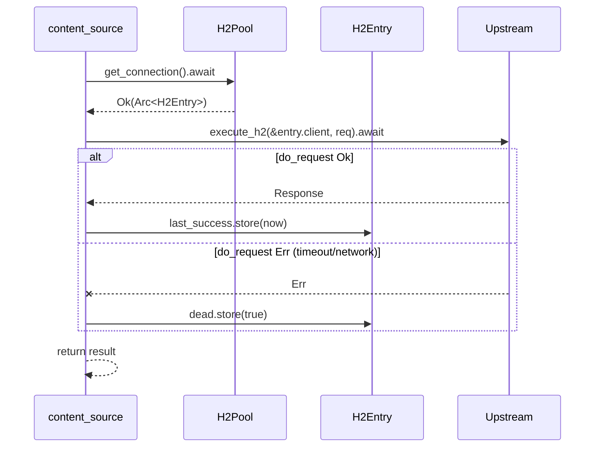
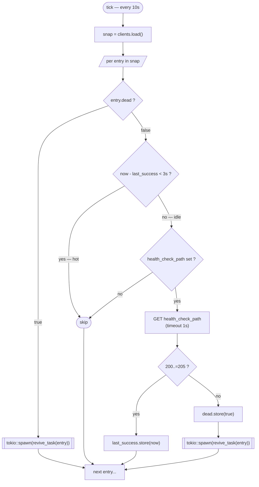
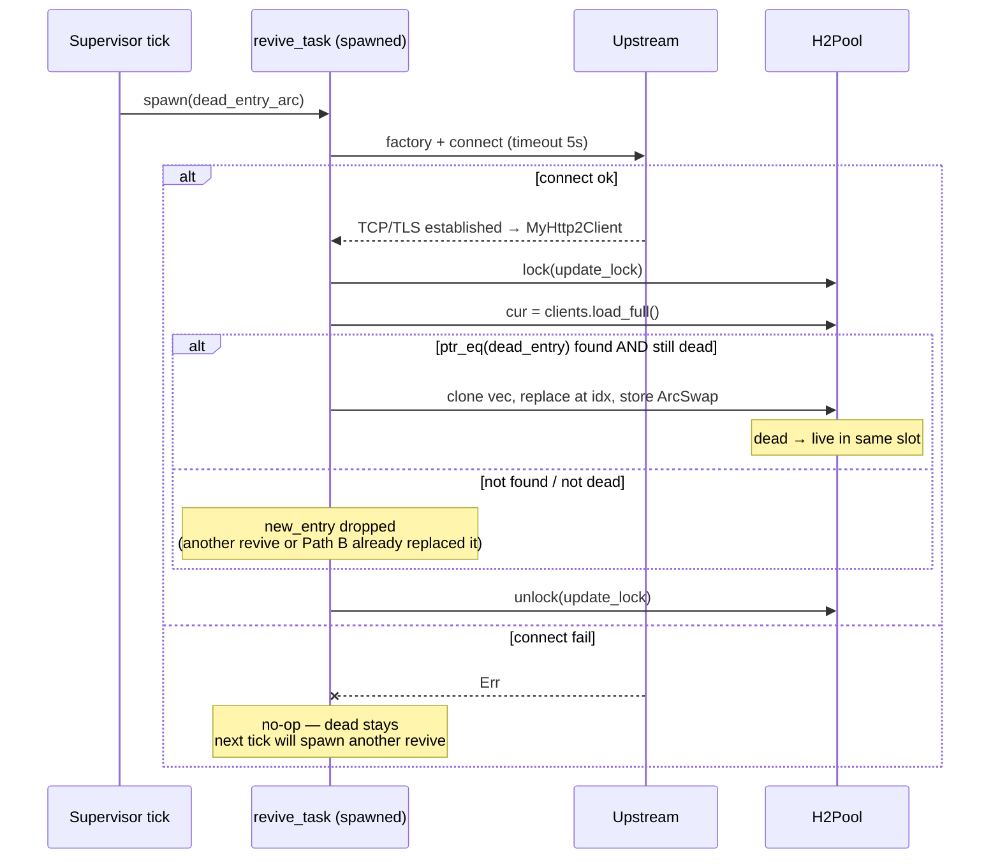
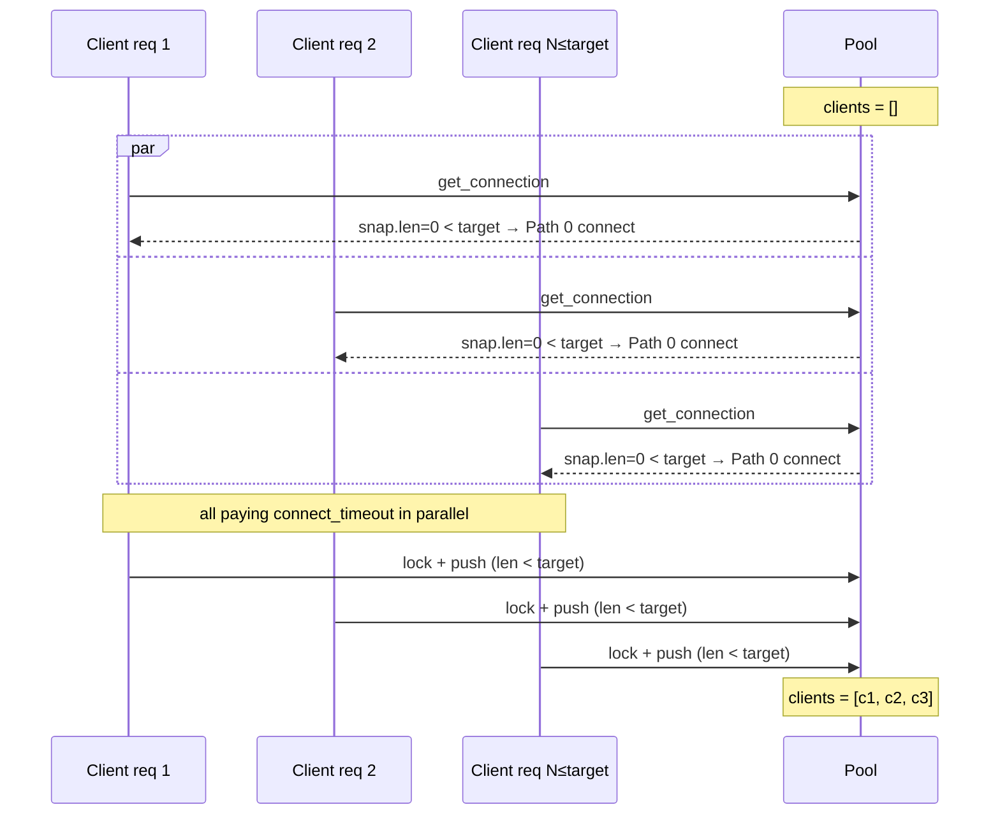
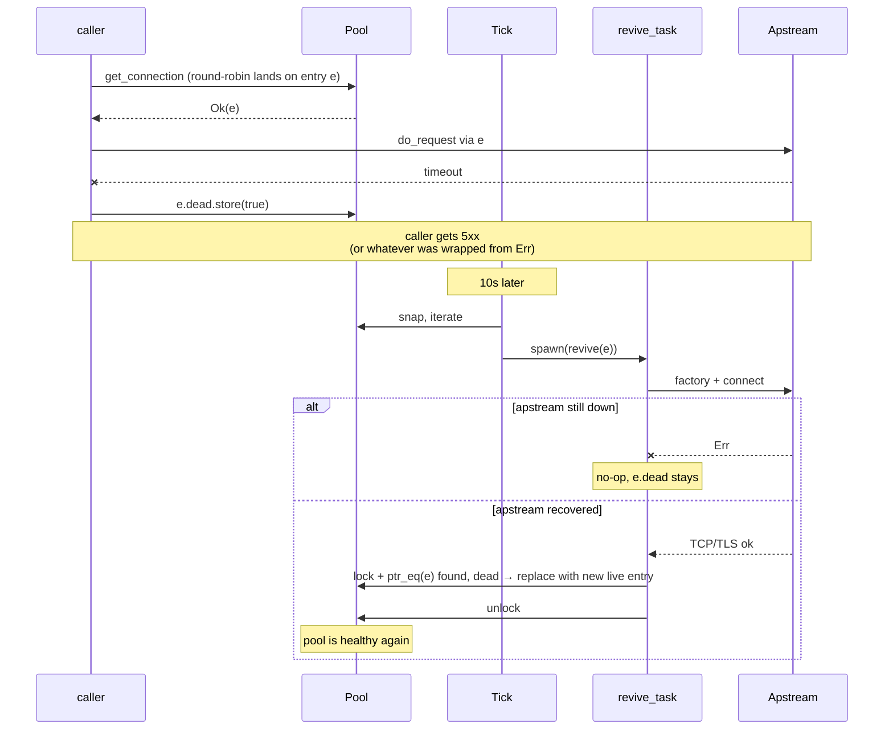

# H2 Upstream Pool — Design

This document describes the design of the per-endpoint HTTP/2 upstream connection pool used by the reverse proxy. One pool per `(scheme, host, port)`; `H2PoolRegistry` keeps them by `PoolKey`.

## Goals

- Cheap multiplexing: one h2 connection serves up to `MAX_CONCURRENT_STREAMS` (≈200) parallel requests. Five connections cover ~1000 in-flight requests with stable file-descriptor usage.
- Lazy growth: no upfront connects on proxy startup; pool fills on demand up to `target_size`.
- Self-healing: dead connections detected by either passive `do_request` failures or active liveness pings; revival is asynchronous so user requests don't pay the connect latency.
- No overshoot: under any race the pool size never exceeds `target_size`.

## Data structures

```rust
pub struct H2Pool<TStream, TConnector> {
    clients:   ArcSwap<Vec<Arc<H2Entry<TStream, TConnector>>>>,
    grow_lock: parking_lot::Mutex<()>,   // brief, no await — only for Path 0 push
    target:    u8,                        // 5 (hardcoded today)
    next:      AtomicUsize,               // round-robin counter
    factory:   ConnectorFactory<TConnector>,
}

pub struct H2Entry<TStream, TConnector> {
    pub client:       ArcSwap<MyHttp2Client<TStream, TConnector>>,  // atomic swap on revival
    pub dead:         AtomicBool,
    pub last_success: AtomicDateTimeAsMicroseconds,                 // refreshed on every successful do_request
    pub revive_lock:  tokio::sync::Mutex<()>,                       // serializes Path B + background revive_task
}
```

- `clients` — the pool list. **Lock-free reads** via `ArcSwap::load()`, atomic snapshot.
- `grow_lock` — only for serializing **Path 0** pushes. Held briefly (no `await`); the connect happens before acquiring it.
- `revive_lock` (per entry) — `tokio::sync::Mutex<()>` held across the connect `await` during revival. Both foreground (Path B) and background (`revive_task`) lock it; re-check of `dead` after acquire prevents duplicate connects.
- `client` (per entry) — `ArcSwap<MyHttp2Client>`, atomically replaced on successful revival.
- `dead` and `last_success` — per-entry atomics; lock-free, visible to all readers immediately.

## get_connection — three paths

`pool.get_connection().await` returns `Result<Arc<H2Entry>, MyHttpClientError>`.

```mermaid
flowchart TD
    Start([get_connection]) --> Load["snap = clients.load()"]
    Load --> SizeCheck{snap.len ?}

    SizeCheck -->|< target| Path0Connect["factory + connect (no lock)"]
    SizeCheck -->|== target| RR["i = next.fetch_add(1) % len"]

    RR --> Pick["entry = snap[i].clone()"]
    Pick --> DeadCheck{entry.dead ?}
    DeadCheck -->|false| PathA([Path A: return Ok(entry)])
    DeadCheck -->|true| PathBConnect["factory + connect (no lock)"]

    Path0Connect --> Path0OK{ok ?}
    Path0OK -->|err| Err1([return Err])
    Path0OK -->|ok| Path0Lock["lock update_lock"]
    Path0Lock --> Path0Recheck{cur.len < target ?}
    Path0Recheck -->|yes| Path0Push["push new_entry, store ArcSwap"]
    Path0Recheck -->|no — race lost| Path0Skip["skip — return new_entry as one-shot"]
    Path0Push --> Ok0([return Ok new_entry])
    Path0Skip --> Ok0

    PathBConnect --> PathBOK{ok ?}
    PathBOK -->|err| Err2([return Err — dead stays])
    PathBOK -->|ok| PathBLock["lock update_lock"]
    PathBLock --> PathBFind{ptr_eq found AND still dead ?}
    PathBFind -->|yes| PathBReplace["replace at idx, store ArcSwap"]
    PathBFind -->|no — race lost| PathBSkip["skip — return new_entry as one-shot"]
    PathBReplace --> OkB([return Ok new_entry])
    PathBSkip --> OkB
```

### Path summary

| Path | Trigger | Action | Outcome |
|------|---------|--------|---------|
| **A** | `len == target`, round-robin pick is `!dead` | Clone the Arc | Hot path; lock-free except for `next.fetch_add` |
| **B** | `len == target`, round-robin pick is `dead` | Connect; under `update_lock` replace by `Arc::ptr_eq` if still there & still dead, else hand out as one-shot | Foreground recovery for that one stale entry |
| **0** | `len < target` (cold start, after cleanup) | Connect; under `update_lock` push if there's still room, else hand out as one-shot | Lazy growth |

The "one-shot" branch happens when concurrent gets race past the size check while we were connecting. The extra `Arc<MyHttp2Client>` that didn't make it into the pool is returned to the caller; once they finish their request and drop the Arc, `MyHttp2Client::Drop` closes the TCP. **No overshoot ever lives in the pool.**

## do_request lifecycle

Every content_source (http2 / https2 / unix_http2) wraps `execute_h2`:



Notes:
- 4xx/5xx HTTP responses are **not** treated as connection errors — the connection is healthy, the request is bad.
- `last_success` is updated only on successful `do_request`. Tick uses it to skip idle/probing of "hot" entries.

## Supervisor tick

Driven by `MyTimer` (panic-safe — a panic in one tick doesn't stop the next). Runs every 10s.



Tick **never removes** anything from the pool itself — that's `revive_task`'s job (on success). Failed revives leave the dead entry in place; the next tick spawns another revive task for it.

### revive_task (tokio::spawn per dead entry)



Concurrency:
- Multiple revive tasks for the same entry are possible (two ticks fired before the first revive completed). The `update_lock` + `ptr_eq` + `dead` re-check ensures only one wins; losers drop their fresh client.
- Path B (foreground) and revive_task (background) use the same `update_lock` + `ptr_eq` reconciliation, so they don't double-replace.

## create_connection — WebSocket fast path

WS upgrade is detected in content_source via `is_h2_extended_connect(req)`. WS goes through `pool.create_connection().await`, which **bypasses the pool entirely** — it just runs `factory + connect` and returns the bare `Arc<MyHttp2Client>`. The h2 connection lives as long as the WS session, then is dropped.

`create_connection` doesn't touch `clients`. The pool's TCP usage is `target` (≤5) for regular traffic + `N` for active WS sessions.

## Concurrency model

| Path | Operation | Synchronization |
|------|-----------|-----------------|
| Hot read (Path A) | Scan `clients` for live | `ArcSwap::load()` — lock-free |
| Round-robin counter | Pick next index | `AtomicUsize::fetch_add` — lock-free |
| Mark dead | `entry.dead.store(true)` | Atomic — no lock needed; idempotent |
| Update last_success | `entry.last_success.store(now)` | Atomic — no lock needed |
| Push (Path 0) | Append entry under final size check | `update_lock` — short critical section |
| Replace (Path B / revive) | Replace at `ptr_eq` index under final dead-check | `update_lock` |
| Snapshot for tick | Iterate entries | `ArcSwap::load()` — lock-free |

`update_lock` is **never held across `await`**. The connect happens before the lock, then the lock is taken just to mutate the `Vec` and store the new `Arc<Vec>` into `ArcSwap`. Lock contention is negligible: writes only happen during pool growth, dead replacement, and revive tasks — at most a few times per minute under steady-state.

## Edge cases

### Cold start



The first `target` parallel requests each pay one `connect`. Subsequent gets find `len == target` and take Path A round-robin clone — cheap.

### Race overshoot prevention

```mermaid
sequenceDiagram
    participant G1 as Get 1
    participant G2 as Get 2
    participant Pool

    Note over Pool: clients = [a, b, c, d] (len=4, target=5)
    G1->>Pool: snap.len < target
    G2->>Pool: snap.len < target
    par
        G1->>G1: factory + connect → x
    and
        G2->>G2: factory + connect → y
    end
    G1->>Pool: lock(update_lock)
    G1->>Pool: cur.len=4 < 5 → push x → [a,b,c,d,x]
    G1->>Pool: unlock
    G2->>Pool: lock(update_lock)
    G2->>Pool: cur.len=5 < 5? NO → skip push
    G2->>Pool: unlock
    Note over G2: y returned to caller as one-shot;<br/>after caller's drop, TCP closes
```

Pool size after both: `[a,b,c,d,x]` — exactly target. `y` served Get 2's request and went away.

### Upstream went down (single endpoint goes flaky)



In the meantime, other gets that round-robin past `e` go through Path B (foreground revive — also fails fast if upstream is down, but succeeds the moment upstream is back).

### Hot pool — no idle pings

If RPS to an endpoint is high enough that every pool entry sees `last_success` updated within 3s, the supervisor tick **does no pings at all** — every entry is "hot" and skipped. Active probing only kicks in for genuinely idle endpoints, which avoids hammering upstreams that are already known-good.

## Metrics

Exposed on `/metrics` (Prometheus):

- `h2_pool_size{endpoint="h2://host:port"}` — configured `target` (5).
- `h2_pool_alive{endpoint="..."}` — current `len(clients)` minus `dead` count, set by tick after the pass.
- `h2_ws_active{endpoint="..."}` — active on-demand WebSocket connections (separate from the pool).

The endpoint label format is consistent with `/configuration` snapshot: `h2://host:port`, `h2s://host:port`, `uds-h2://path`.

## Hardcoded parameters (today)

- `target_size = 5`
- `health_check_interval = 10s` (the MyTimer cadence)
- `ping_timeout = 1s`
- `connect_timeout = 5s` (per `PoolParams`, default)
- "Hot threshold" `last_success` window = `3s`
- Success status range for ping = `200..=205`

All of these are tracked as tech debt for YAML configuration.

## Out of scope

- h1 upstream pool — separate module (`upstream_h1_pool/`), different model (5 reusable slots + disposable on overflow with `rented` flag). Untouched by this design.
- `http2_over_ssh` — still uses the legacy `Http2ClientPool` from `src/http2_client_pool/`. Migration would require a similar `H2PoolRegistry<SshAsyncChannel, ...>` setup.
- Hot-reload `drain_unused` — written but not yet called from the configuration reloader. Pools for removed endpoints leak until restart.
