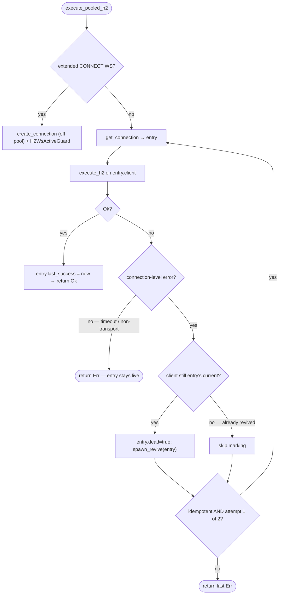
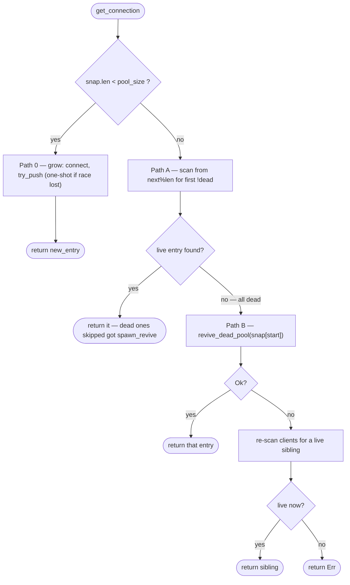

# H2 Upstream Pool — Design

This document describes the per-**location** HTTP/2 upstream connection pool used
by the reverse proxy. One pool per proxy-pass **location** (`location_id`);
`H2PoolRegistry` keeps them in a `SortedVecOfArc<i64, H2Pool>` keyed by
`location_id`.

Two locations that point at the same `(scheme, host, port)` get **two
independent pools** (2×`pool_size` connections) — pooling is per-location **by
design**, not coalesced per endpoint. Across a config reload a location keeps its
`location_id` (and therefore its pool) when its `id_string`
(`listen_host|path->type|target`) is unchanged **and a live pool with that
`id_string` still exists** at apply time — `find_location_id_by_id_string` scans
the current registries. A location whose pool was never created (lazy — no
traffic yet) or was drained gets a fresh `location_id` from
`APP_CTX.get_next_id()` on reload, so the `#<location_id>` suffix in metric
labels is stable only for actively-pooled locations.

## Design goal: invisibility

The overriding goal is that **upstream connection churn is invisible to endpoint
clients**. Concretely:

- A single dead pool connection is (almost always) invisible to clients —
  requests are routed around it (pick-live), and for idempotent methods the one
  request that first hit it is failed over to a healthy connection. A
  non-idempotent request that hits it mid-flight is the sole exception: it
  surfaces one error (no replay, to avoid double-execution).
- An upstream restart heals in the background (revive) and, once
  [item 3](pool-invisibility-plan.md) lands, is detected by h2 keep-alive PINGs
  before user traffic even touches a stale connection.
- A genuine full outage fails **fast** (bounded 503, no timeout cascade), never
  as a pile-up of requests each blocking on a dead dial.

Supporting properties:

- Cheap multiplexing: one h2 connection serves up to the upstream's advertised
  `SETTINGS_MAX_CONCURRENT_STREAMS` (≈200 by hyper's default). Five connections
  cover ~1000 in-flight requests with stable FD usage. (The proxy neither sets
  nor enforces that limit, and routing is plain round-robin — it does not
  account for per-connection stream load.)
- Lazy growth: no upfront connects on startup; the pool fills on demand and is
  topped up to `pool_size` in the background.
- No overshoot: under any race the pool size never exceeds `pool_size`.

## Three layers

The invisibility logic is split across three layers, outermost first:

| Layer | Where | Responsibility |
|-------|-------|----------------|
| **1 — request** | `execute_pooled_h2` in `content_source/h2_dispatch.rs` | Run the request; on a *connection-level* error, mark the entry dead, kick a background revive, and (idempotent methods only) fail over to another live entry. |
| **2 — pool** | `H2Pool::get_connection` in `upstream_h2_pool/h2_pool.rs` | Hand out a live entry: grow if below target (Path 0), pick the first live one (Path A / pick-live), or recover a fully-dead pool with a bounded, coalesced attempt (Path B). |
| **3 — supervisor** | `H2Pool::supervisor_tick` in `upstream_h2_pool/pool_supervisor.rs` | Every ~10s: top the pool up to `pool_size`, revive dead entries, and actively ping idle-but-live ones. |

Below all three sits `MyHttp2Client::do_request` (in `my-http-client`), which has
its **own** internal reconnect-and-replay loop. Its interaction with layer 1 is
called out where it matters, and it is being hardened separately (item 3).

## Data structures

```rust
pub struct H2Pool<TStream, TConnector> {
    desc:           PoolDesc,               // location_id, name, authority, id_string
    params:         PoolParams,             // pool_size, timeouts, hot_window, cooldowns, health_check_path
    clients:        ArcSwap<Vec<Arc<H2Entry<...>>>>,
    grow_lock:      parking_lot::Mutex<()>, // brief, no await — Path 0 push + try_push
    next:           AtomicUsize,            // round-robin start position
    shutdown:       AtomicBool,             // set by drain_unused; stops supervisor/revive/top-up/push
    top_up_pending: AtomicBool,             // dedups background top-up tasks
    factory:        ConnectorFactory<TConnector>,
    last_status:    AtomicUpstreamStatus,   // last connect/revive/ping outcome — admin UI only
}

pub struct H2Entry<TStream, TConnector> {
    pub client:              ArcSwap<MyHttp2Client<...>>,      // atomically swapped on revival
    pub dead:                AtomicBool,
    pub last_success:        AtomicDateTimeAsMicroseconds,     // refreshed on every successful request
    pub revive_pending:      AtomicBool,                       // a background revive is in flight
    pub last_revive_attempt: AtomicDateTimeAsMicroseconds,     // start of the last dial; epoch initially
    pub revive_lock:         tokio::sync::Mutex<()>,           // serializes revival of THIS entry
}
```

- `clients` — **lock-free reads** via `ArcSwap::load()`. Rewritten only on growth
  (Path 0 / top-up push); **never** on revival (revival swaps the entry's inner
  `client` ArcSwap in place, not the vec).
- `dead`, `last_success`, `revive_pending`, `last_revive_attempt` — per-entry
  atomics; lock-free, immediately visible to all readers.
- `last_revive_attempt` starts at **epoch** so a fresh entry is never inside the
  revive cooldown window (its first dial is always allowed).

## Layer 1 — request flow (`execute_pooled_h2`)

Shared by all three h2 content sources (tcp / tls / uds — they differ only in
stream & connector type, so the body is one generic helper).


```mermaid
flowchart TD
    Start([execute_pooled_h2]) --> WS{extended CONNECT WS?}
    WS -->|yes| WSPath["create_connection (off-pool) + H2WsActiveGuard"]
    WS -->|no| Attempt

    Attempt["get_connection → entry"] --> Run["execute_h2 on entry.client"]
    Run --> OK{Ok?}
    OK -->|yes| Success["entry.last_success = now → return Ok"]
    OK -->|no| ConnLevel{connection-level error?}
    ConnLevel -->|no — timeout / non-transport| ReturnErr([return Err — entry stays live])
    ConnLevel -->|yes| StaleCheck{client still entry's current?}
    StaleCheck -->|yes| MarkDead["entry.dead=true; spawn_revive(entry)"]
    StaleCheck -->|no — already revived| SkipMark[skip marking]
    MarkDead --> Retry
    SkipMark --> Retry
    Retry{idempotent AND attempt 1 of 2?}
    Retry -->|yes| Attempt
    Retry -->|no| ReturnLastErr([return last Err])
```

Key rules:

- **WebSocket** (extended CONNECT): a dedicated **off-pool** connection via
  `create_connection`, held alive by `H2WsActiveGuard` for the session. Never
  touches `clients`.
- **Failover retry** is **idempotent-only** (`req.method().is_idempotent()` →
  GET/HEAD/PUT/DELETE/OPTIONS/TRACE): up to 2 attempts, landing on a different
  live entry the second time (pick-live skips the one just marked dead).
  POST/PATCH get a single attempt — a lost reply must not double-execute.
  - Caveat (until item 3 lands): `MyHttp2Client::do_request` still has its own
    internal reconnect-replay, so the "no double-execution of non-idempotent
    requests" guarantee is not yet end-to-end.
  - Replayed PUT/DELETE may observably substitute the response (a replayed
    DELETE returning 404 after the first succeeded) — same policy as nginx's
    default for idempotent methods.
- **Timeout ≠ dead**: `is_connection_level_error` excludes
  `MyHttpClientError::RequestTimeout` (and `UpgradedToWebSocket`). A slow upstream
  is not a broken connection — the entry stays in rotation and the request is not
  replayed (replaying a slow request would double the load on an already-degraded
  upstream, and marking the shared connection dead would churn every other stream
  multiplexed on it).
- **Stale-client guard**: dead-marking + `spawn_revive` happen only when
  `Arc::ptr_eq(&client, &entry.client.load_full())` — a straggler failing on a
  connection that a background revive already swapped out must not re-kill the
  freshly healthy entry.
- **No extra clone for failover**: the request is passed **by reference**
  (`&Request`) through `execute_h2` → `do_request` on every attempt, so the retry
  costs no request clone — the only clone is the one `send_payload` already makes
  internally on the actual send. (`do_request` taking `&req` is what lets the
  failover loop reuse the same request across attempts.)
- 4xx/5xx HTTP responses are **not** errors — they return `Ok`.

## Layer 2 — `get_connection` (three paths)

`pool.get_connection().await` (receiver `self: &Arc<Self>`) returns
`Result<Arc<H2Entry>, MyHttpClientError>`.


```mermaid
flowchart TD
    Start([get_connection]) --> SizeCheck{snap.len < pool_size ?}

    SizeCheck -->|yes| Path0["Path 0 — grow: connect, try_push (one-shot if race lost)"]
    Path0 --> Ok0([return new_entry])

    SizeCheck -->|no| PickLive["Path A — scan from next%len for first !dead"]
    PickLive --> Found{live entry found?}
    Found -->|yes| OkA([return it — dead ones skipped got spawn_revive])
    Found -->|no — all dead| PathB["Path B — revive_dead_pool(snap[start])"]
    PathB --> PBResult{Ok?}
    PBResult -->|yes| OkB([return that entry])
    PBResult -->|no| Rescan["re-scan clients for a live sibling"]
    Rescan --> RFound{live now?}
    RFound -->|yes| OkB2([return sibling])
    RFound -->|no| ErrB([return Err])
```

- **Path 0 — grow**: below target → connect, then `try_push` (append under
  `grow_lock` with a final size re-check *and* a `shutdown` re-check). If the push
  loses the size race, the connection is handed back as a **one-shot** (serves
  this request, then drops — `MyHttp2Client::Drop` disposes it asynchronously).
  No overshoot ever lives in the pool.
- **Path A — pick-live**: at target, scan from a round-robin start for the first
  `!dead` entry and return it (lock-free). Every dead entry skipped along the way
  gets a background `spawn_revive`. **A request never blocks on a reconnect while
  the pool has any live capacity** — this is the core of invisibility.
- **Path B — all dead**: no live entry. One coalesced foreground attempt on the
  round-robin pick via `revive_dead_pool` (bounded — see below). On `Err`, the
  pool is **re-scanned** for a sibling that a background revive brought up in the
  meantime, and that sibling serves the request instead of a 503.

## Revive mechanics

Three functions, one shared inner step:

- `revive_entry` — background callers (supervisor / pick-live's `spawn_revive`).
  Takes `revive_lock` with an **unbounded** wait, then `revive_under_lock`.
- `revive_dead_pool` — foreground Path B. Waits for `revive_lock` only up to
  `dead_pool_wait_budget`; on timeout, fails fast (so a request never queues
  behind an in-flight dial for longer than the budget), then `revive_under_lock`.
- `revive_under_lock` (caller holds the lock):
  1. re-check `dead` — a parallel caller may have already revived → `Ok`, no work;
  2. **cooldown gate** — if within `revive_cooldown` of `last_revive_attempt`,
     fail fast (a down upstream costs at most one dial per window per entry);
  3. stamp `last_revive_attempt`, `connect_one`, then `client.store(new)` in
     place, `last_success = now`, `dead = false`.

The cooldown uses `H2Entry::revive_cooldown_remaining`, which treats a stamp in
the **future** (a backward wall-clock step) as expired — revival never freezes on
a clock jump.

`spawn_revive` (the dedup gate for background revives, shared by the supervisor
tick and pick-live) skips when any of these hold:

- pool is `shutdown`;
- entry is no longer `dead`;
- entry is **not present in `clients`** (a Path 0 one-shot orphan — reviving it
  would dial a connection no future request could ever pick);
- still inside `revive_cooldown`;
- `revive_pending` CAS `false→true` loses (a task is already in flight).

The spawned task owns a `RevivePendingGuard` created **before** the spawn, which
clears `revive_pending` on any exit — normal return, a panic inside
`revive_entry`, or the future being dropped unpolled (runtime shutdown). Without
it a panic would strand the flag `true` and the entry would be permanently
unrevivable.

## Layer 3 — supervisor tick

Driven by `PoolSupervisorTimer` on a panic-safe `MyTimer` at
`APP_CTX.pool_supervisor_interval` (default 10s). One pass iterates **all** pools
of all 6 registries (h1/h2 × tcp/tls/uds) via `list_pools()`.

For each h2 pool, `supervisor_tick`:

1. `spawn_top_up()` — if `0 < total_count() < pool_size`, CAS `top_up_pending`
   and spawn a task that loops `connect_one` + `try_push` until full / a dial
   fails / `shutdown`. **An empty pool is skipped** — that means it was never
   used (or was drained), and creation must stay lazy. The task holds a
   `TopUpPendingGuard` (same panic-safe pattern as revive). This lets a low-RPS
   location warm to `pool_size` instead of paying a connect on each of the first
   `pool_size` requests.
2. Per entry:
   - `dead` → `spawn_revive` (background).
   - live and `now - last_success < hot_window` → skip (hot, no probe needed).
   - live and idle and `health_check_path` set → GET-ping (`ping_timeout`);
     success (`200..=205`) refreshes `last_success`, failure marks `dead` +
     `spawn_revive`.
3. Update the `h2_pool_alive` gauge — **but not** if the pool is `shutdown`
   (a drained pool's gauge was reset by `drain_unused` and must stay reset).

Tick **never removes** entries; dead ones are revived in place. Pool *removal* is
a separate concern — see Lifecycle & GC.

## create_connection — WebSocket fast path

WS upgrade is detected via `is_h2_extended_connect(req)` and goes through
`pool.create_connection()`, which **bypasses the pool** — it just runs
`factory + connect` and returns the bare `Arc<MyHttp2Client>`, held alive by
`H2WsActiveGuard` for the session (which also drives the `h2_ws_active` gauge).
Pool TCP usage is `pool_size` for regular traffic + `N` active WS sessions.

## Concurrency model

| Operation | Synchronization |
|-----------|-----------------|
| Pick-live scan (Path A) | `ArcSwap::load()` — lock-free |
| Round-robin start | `AtomicUsize::fetch_add` — lock-free |
| Mark dead / update last_success / revive_pending | atomics — no lock |
| Push (Path 0 / top-up) via `try_push` | `grow_lock` (parking_lot) — short, **no await** |
| Revive in place | per-entry `revive_lock` (tokio async) — **held across the connect await** |
| Snapshot for tick | `ArcSwap::load()` — lock-free |

`grow_lock` is never held across an `await` — the connect happens before it, then
it is taken only to clone the vec, push, and store. `revive_lock` **is** held
across the connect await, but it is per-entry, so it only serializes concurrent
revivals of that one slot and never blocks the hot pick-live path or the other
slots.

## Edge cases

### One dead connection — fully invisible

Pool at `pool_size`, one entry `e` dies (its `do_request` returned a
connection-level error). Layer 1 marks `e` dead and, for an idempotent request,
retries: layer 2's pick-live skips `e` and returns a live sibling; the client
sees a normal response. `e` is revived in the background. For a non-idempotent
request the client gets the one error (no double-execute), but every *subsequent*
request routes around `e` until it is revived. Net client impact: at most one
failed non-idempotent request.

### Upstream fully down

All entries dead. Path A finds nothing → Path B `revive_dead_pool`: waiters block
at most `dead_pool_wait_budget` (default 500ms) on the lock, then fail fast; the
one request that wins the lock dials (the "canary", up to `connect_timeout`) and
brings **its** entry live the instant the upstream returns — the pool is usable
again immediately (one live slot), and the remaining slots are revived on
subsequent pick-live skips and supervisor passes. Repeat dials are gated to one
per `revive_cooldown` (500ms) per entry, so there is no connect storm — just a
bounded stream of fast 503s while the upstream is genuinely down.

### Race overshoot prevention

Two concurrent Path 0 / top-up connects both finish; each calls `try_push`, which
re-checks `len < pool_size` under `grow_lock`. The first pushes; the second sees
the pool full and hands its connection back as a one-shot. Pool size ends exactly
at `pool_size`.

### Hot pool — no idle pings

If every entry sees `last_success` refreshed within `hot_window` (default 3s), the
tick pings nothing — active probing only runs for genuinely idle-but-live
entries, avoiding needless load on known-good upstreams.

## Metrics

Exposed on `/metrics` (Prometheus), all with a single `endpoint` label:

- `h2_pool_size{endpoint=...}` — configured `pool_size`.
- `h2_pool_alive{endpoint=...}` — `len(clients)` minus dead count, set after each
  tick, background revive, and top-up (skipped when the pool is `shutdown`).
- `h2_ws_active{endpoint=...}` — active off-pool WebSocket connections, tracked by
  `H2WsActiveGuard`.

The `endpoint` label value is the pool `name`: `h2://host:port#<location_id>`,
`h2s://host:port#<location_id>`, `uds-h2://<socket_path>#<location_id>`. The
`#<location_id>` suffix keeps two locations on the same upstream as distinct
series (they are distinct pools).

## Parameters

Configuration-driven (`PoolParams`, built per location from `PoolTuning` + global
settings); the values below are the compiled-in defaults from `src/consts.rs`.

| Parameter | Source | Default |
|-----------|--------|---------|
| `pool_size` | `PoolTuning` (per proxy_pass) | `DEFAULT_POOL_SIZE = 5` |
| `connect_timeout` | `proxy_pass.connect_timeout` | `DEFAULT_HTTP_CONNECT_TIMEOUT = 5s` |
| `ping_timeout` | `PoolTuning` | `DEFAULT_POOL_PING_TIMEOUT = 1s` |
| `hot_window` | `PoolTuning` | `DEFAULT_POOL_HOT_WINDOW = 3s` |
| `revive_cooldown` | `PoolParams` | `DEFAULT_POOL_REVIVE_COOLDOWN = 500ms` |
| `dead_pool_wait_budget` | `PoolParams` | `DEFAULT_POOL_DEAD_POOL_WAIT_BUDGET = 500ms` |
| supervisor interval | `global_settings` → `get_pool_supervisor_interval()` | `DEFAULT_POOL_SUPERVISOR_INTERVAL = 10s` |
| `health_check_path` | global `global_settings.default_h2_livness_url` | `None` (reactive-only) |
| ping success range | hardcoded | `200..=205` |

Notes:

- `PoolParams` is captured at pool creation. **A reload never re-applies changed
  params to a live pool**: `ensure_pool` returns the existing pool and discards
  the freshly-built `PoolParams`, and the pool survives reload via `id_string`
  (which excludes params). Edited `pool_size`/timeouts/`health_check_path` take
  effect only after a restart or a change to the location's identity.
- `health_check_path` is a **single global** liveness path applied to every h2
  pool — no per-location health-check path yet (backlog). If `None`, the
  supervisor never actively pings; dead detection is then purely reactive.
- The liveness ping URI is always `http://{authority}{path}` — `:scheme=http`
  even toward TLS upstreams, since the h2 connection is already established.

## Lifecycle & GC

Pools are created lazily (first request → `ensure_pool`) and removed by
`GcPoolsTimer` (every 60s), which calls `registry.drain_unused(desired)` for all
6 registries with the `location_id`s referenced by the current configuration —
see [pool-lifecycle.md](pool-lifecycle.md). `drain_unused` sets
`pool.shutdown = true` (stopping the supervisor, revives, top-ups, and pushes)
and drops the pool `Arc` from the registry; the entries and their
`MyHttp2Client`s then close via `Arc` ownership as in-flight requests finish.

## Out of scope / future

- **Item 3 (in progress)** — h2 keep-alive PINGs + an `is_alive()` transport
  flag in `my-http-client`, so a stale connection is detected before user traffic
  touches it (pick-live will treat `!is_alive()` as dead). Also hardens
  `do_request`'s internal replay to be method-aware and bounded. See
  [pool-invisibility-plan.md](pool-invisibility-plan.md).
- h1 upstream pool — separate module (`upstream_h1_pool/`), different model.
- `http2_over_ssh` — still uses the legacy `Http2ClientPool` from
  `src/http2_client_pool/` (`Http2OverSshContentSource`).
- Per-location `health_check_path` — today a single global path is used.
- Load-aware connection selection — routing is plain round-robin.
