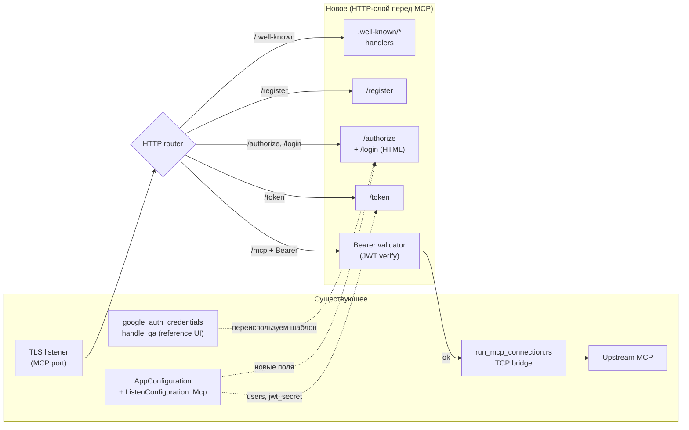
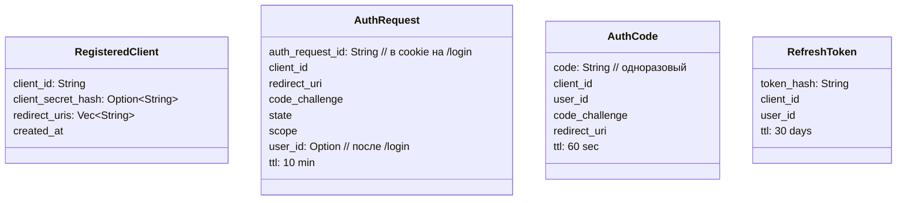

# OAuth для MCP proxy-pass

## Контекст

В `my-reverse-proxy` есть MCP proxy-pass ([run_mcp_connection.rs:13](../src/tcp_listener/mcp/run_mcp_connection.rs#L13)), который сейчас делает чистый TCP-bridge без авторизации. Нужно добавить OAuth 2.1 + PKCE с Dynamic Client Registration, чтобы Claude Code (или другой MCP-клиент) при первом подключении сам открывал браузер на нашу страничку логина, юзер вводил логин/пароль из конфига proxy, и дальше всё работало молча — токены сохраняются в Claude, refresh-обновление прозрачно.

## Сводка решения

- **Flow:** OAuth 2.1 Authorization Code + PKCE (S256), redirect_uri = `http://127.0.0.1:RAND/cb` (Claude поднимает локально).
- **Identity:** простая HTML-форма `/login` с проверкой логин/пароль из конфига proxy (как сейчас Google credentials).
- **AS = MCP сервер:** все эндпоинты OAuth живут на том же хосте, что и MCP — иначе Claude не свяжет одно с другим.
- **Токены:** access = JWT (HS256, секрет в конфиге, без хранилища); refresh = opaque + лёгкое хранилище.
- **DCR:** in-memory регистрация (ttl 24ч хватит — Claude перерегистрируется при необходимости).

## Mermaid: общий flow

```mermaid
sequenceDiagram
    autonumber
    participant U as User
    participant C as Claude Code
    participant B as Browser
    participant P as my-reverse-proxy<br/>(AS + MCP)
    participant M as Upstream MCP

    Note over C,P: 1. Discovery (no token)
    C->>P: POST /mcp (без Bearer)
    P-->>C: 401 + WWW-Authenticate:<br/>resource_metadata=…

    C->>P: GET /.well-known/oauth-protected-resource
    P-->>C: { authorization_servers:[https://proxy] }
    C->>P: GET /.well-known/oauth-authorization-server
    P-->>C: { authorize, token, register, …, S256 }

    Note over C,P: 2. Dynamic Client Registration
    C->>P: POST /register {client_name,…}
    P-->>C: { client_id, (client_secret) }

    Note over C,B,P: 3. Authorization Code + PKCE
    C->>C: gen verifier+challenge
    C->>B: open /authorize?client_id&challenge&<br/>redirect_uri=http://127.0.0.1:R/cb&state
    B->>P: GET /authorize
    P-->>B: HTML login form
    U->>B: вводит login/password
    B->>P: POST /login (creds + auth_request_id)
    P->>P: проверка по конфигу
    P-->>B: 302 → http://127.0.0.1:R/cb?code=AC&state
    B->>C: redirect на локальный listener
    C->>P: POST /token<br/>(code + verifier + client_id)
    P->>P: verify PKCE, выдать JWT+refresh
    P-->>C: { access_token (JWT), refresh_token, expires_in }
    C->>C: сохранить токены локально

    Note over C,M: 4. Работа
    C->>P: POST /mcp + Bearer JWT
    P->>P: verify JWT (HS256, exp, aud)
    P->>M: проксируем (TCP bridge как сейчас)
    M-->>P: ответ
    P-->>C: ответ

    Note over C,P: 5. Refresh (тихо, без юзера)
    C->>P: POST /token grant_type=refresh_token
    P-->>C: новый access+refresh
```

## Mermaid: где это в коде



## Состояние, которое надо хранить



(всё in-memory `Arc<Mutex<HashMap>>` достаточно для proxy с одним инстансом; persistence — потом)

## Файлы (ориентир, детали — после Phase 2)

- **Новые:** `src/oauth/` — модуль с router, handlers (well-known, register, authorize, login, token), JWT utils, store.
- **Меняем:** [run_mcp_connection.rs](../src/tcp_listener/mcp/run_mcp_connection.rs) — поднять HTTP-слой перед TCP-bridge, разветвлять по path.
- **Конфиг:** новые поля в `ListenConfiguration::Mcp` или `ProxyPassToConfig::McpHttp1`: `oauth: { users:[{login,password_hash}], jwt_secret, issuer }`.
