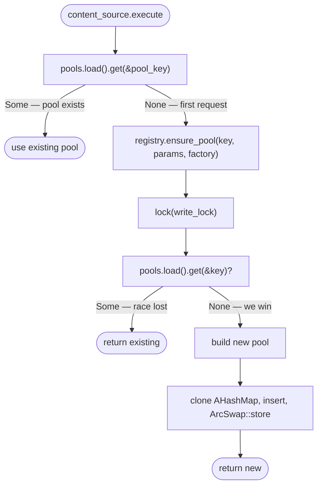
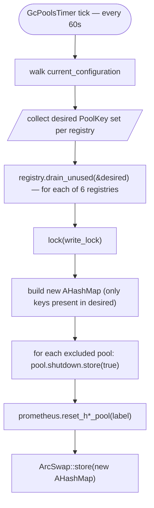

# H1 / H2 Upstream Pool Lifecycle

How pools (`H1Pool` / `H2Pool`) appear in and disappear from the registries (`H1PoolRegistry` / `H2PoolRegistry`). For per-pool internal mechanics see [h1-pool.md](h1-pool.md) and [h2-pool.md](h2-pool.md).

There are **6 registries** in `AppContext`: h1/h2 × tcp/tls/uds.

## Registry storage model

```rust
pub struct H1PoolRegistry<...> {
    pools:      ArcSwap<AHashMap<PoolKey, Arc<H1Pool>>>,
    write_lock: parking_lot::Mutex<()>,
}
```

`AHashMap` (`ahash` crate) instead of `std::collections::HashMap` — same API, faster non-cryptographic hasher.

- **Reads** (`get`, `list_pools`, `snapshot`) — lock-free via `ArcSwap::load()`.
- **Writes** (`ensure_pool`, `drain_unused`) — under `write_lock`. Held briefly, no `await` inside. Serializes all write operations against each other so they don't race.

## Creation — lazy, on first request

Config load and hot reload **do not create pools**. They only build content_source structs that hold:
- `pool_key: PoolKey`
- `pool_params: PoolParams`
- `factory: ConnectorFactory<...>`

The first request that hits a content_source triggers creation:



- `ensure_pool` has a lock-free fast path: most calls (after the first) just read from `ArcSwap` and return.
- The slow path takes `write_lock`, re-checks under lock to handle two concurrent first-requests on the same key, then builds and stores.
- No connect happens in `ensure_pool` itself — only the empty `H*Pool` shell. The first connect happens later inside `pool.get_connection()` (Phase 0 — see per-pool doc).

## Cleanup — `GcPoolsTimer` (every 60s)

The criterion is simple: **a pool is removed if no location in the current configuration references its endpoint.**



That's it. The pool is just dropped from the AHashMap. Nothing else.

In-flight requests / WS sessions naturally finish (or time out) and their connections close themselves via Rust's `Arc` ownership — they don't get returned to the pool because the pool is no longer in the registry to receive them.

If the same endpoint comes back in a later YAML reload, the next request triggers `ensure_pool` again and a fresh pool is created.

## Race-safety

- **`ensure_pool` vs `ensure_pool` (concurrent first requests on same key):** both pass the lock-free fast path, both wait on `write_lock`. Winner builds and stores; loser re-checks and returns existing. No double-create.
- **`ensure_pool` vs `drain_unused`:** both take the same `write_lock`, fully serialized. Either ensure runs first (then drain may immediately remove if not in desired — correct, it shouldn't be there) or drain runs first (then ensure recreates it).
- **Hot get vs writes:** reads are lock-free, never blocked. Worst case a request takes a slightly stale snapshot — either gets the old pool (works fine, will reach shutdown=true on next loop iteration of `get_connection`) or misses a brand-new one (returns 503, retried by client).

## Where to look in code

- Helpers: [src/configurations/proxy_pass_location_config.rs](../src/configurations/proxy_pass_location_config.rs) — `make_*_pool_factory` functions (pure, no side effects).
- Registries: [src/upstream_h1_pool/pool_registry.rs](../src/upstream_h1_pool/pool_registry.rs), [src/upstream_h2_pool/pool_registry.rs](../src/upstream_h2_pool/pool_registry.rs).
- GC timer: [src/timers/gc_pools_timer.rs](../src/timers/gc_pools_timer.rs).
- Registration: [src/main.rs](../src/main.rs) — `GcPoolsTimer` registered with `MyTimer(60s)`.
